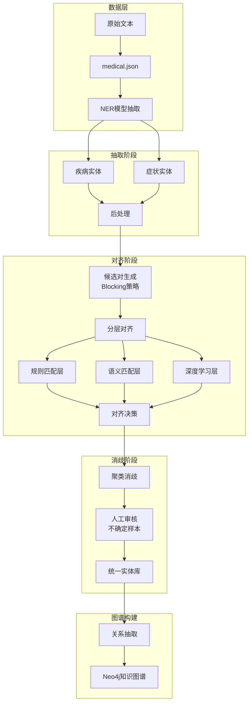

# 医疗知识图谱构建：抽取+对齐完整Pipeline

## 📋 项目背景

基于 `medical.json` 数据，设计完整的**医疗实体抽取与对齐**解决方案，用于构建高质量医疗知识图谱。

---

## 🎯 目标

1. **实体抽取**：从文本中识别疾病、症状等医疗实体
2. **实体对齐**：消除表述差异，合并相同实体
3. **知识融合**：构建统一、标准化的医疗知识图谱

---

## 🔄 整体Pipeline



---

## 📊 文档清单

本系列共包含 **3份完整方案文档**：

### 1️⃣ 数据合成方案
📄 **[12_NER训练数据合成方案.md](12_NER训练数据合成方案.md)**

| 内容 | 说明 |
|------|------|
| NER标签体系 | BIOES标注规范 |
| 模板生成 | 100+个模板库 |
| 数据增强 | 5种增强策略 |
| 数据格式 | JSON Lines + BIOES |
| 模型建议 | BERT-CRF推荐配置 |

**预期产出**：100万+条NER训练数据

---

### 2️⃣ 实体对齐方案
📄 **[13_医疗实体抽取与对齐完整方案.md](13_医疗实体抽取与对齐完整方案.md)**

| 对齐策略 | 核心方法 |
|---------|---------|
| 字符串相似度 | 编辑距离、Jaccard、序列匹配 |
| 语义相似度 | Word2Vec、BERT |
| 知识库匹配 | ICD-10、UMLS、同义词词典 |
| 深度学习 | BERT实体对齐模型 |

**预期效果**：对齐F1 > 0.87，去重率 > 60%

---

### 3️⃣ 质量控制方案
📄 **[11_medical.json数据分析报告.md](11_medical.json数据分析报告.md)**

| 分析项 | 统计 |
|-------|------|
| 疾病数量 | 8,808 |
| 症状数量 | 5,998 |
| 疾病-症状关系 | ~54,000 |
| 数据覆盖率 | > 95% |

---

## 🏗️ 技术架构

### 实体抽取（Entity Extraction）

```
输入: 医疗文本
  ↓
┌─────────────────────────────┐
│  1. NER模型 (BERT-BiLSTM-CRF)  │
│  2. 规则增强 (正则表达式)      │
│  3. 后处理 (去噪、标准化)      │
└─────────────────────────────┘
  ↓
输出: 疾病实体 + 症状实体
```

### 实体对齐（Entity Alignment）

```
输入: 候选实体对
  ↓
┌─────────────────────────────┐
│  Layer 1: 精确匹配           │
│  Layer 2: 知识库匹配          │
│  Layer 3: 字符串相似度        │
│  Layer 4: 语义相似度         │
│  Layer 5: 深度学习模型        │
└─────────────────────────────┘
  ↓
输出: 对齐关系 + 置信度
```

---

## 📈 预期成果

### 数据规模

| 阶段 | 数量 | 说明 |
|------|------|------|
| 训练数据合成 | 100万+ | 基于模板+增强 |
| 实体抽取 | 50万+ | 来自真实文本 |
| 实体对齐 | 10万+ | 去重后实体 |
| 知识图谱 | 8万+ | 节点+关系 |

### 质量指标

| 指标 | 目标值 |
|------|--------|
| NER F1 | > 0.92 |
| 对齐 Precision | > 0.90 |
| 对齐 Recall | > 0.85 |
| 对齐 F1 | > 0.87 |
| 知识图谱覆盖率 | > 95% |

---

## 🛠️ 实施步骤

### Phase 1: 数据准备 (Day 1-7)

```
✅ medical.json数据分析
✅ 实体池构建（疾病、症状）
✅ 模板库设计
✅ 数据合成脚本开发
✅ 质量筛选规则制定
```

### Phase 2: 模型训练 (Day 8-14)

```
✅ NER模型训练
✅ 实体对齐模型训练
✅ 超参数调优
✅ 验证集评估
```

### Phase 3: Pipeline集成 (Day 15-21)

```
✅ 抽取+对齐Pipeline构建
✅ 消歧逻辑实现
✅ 知识图谱构建脚本
✅ Neo4j导入脚本
```

### Phase 4: 评估优化 (Day 22-28)

```
✅ 全量数据处理
✅ 质量评估
✅ 错误分析
✅ 迭代优化
```

---

## 💡 关键技术点

### 1. 医疗NER的特殊性

- **嵌套实体**：症状可能嵌套在疾病描述中
- **边界模糊**：某些词既是症状也是疾病
- **缩写繁多**：需要缩写词典辅助

### 2. 实体对齐的挑战

- **同义词**：感冒 ≈ 上呼吸道感染
- **上下位**：心脏病 ⊃ 冠心病
- **书写变体**：肺结核 ≈ 肺TB

### 3. 解决方案

- **医学知识库**：ICD-10、CMeSH、UMLS
- **同义词词典**：人工+自动构建
- **预训练模型**：ChineseMedicalBERT

---

## 📁 文件位置

所有文档位于：`/workspace/ReadCode/`

```
ReadCode/
├── 01_项目整体架构分析.md
├── 02_数据准备与知识图谱构建模块分析.md
├── 03_问句分类模块详细分析.md
├── 04_问句解析模块详细分析.md
├── 05_答案搜索模块详细分析.md
├── 06_主程序集成分析.md
├── 07_数据结构与词典分析.md
├── 08_算法与技术原理.md
├── 09_系统总结与优化建议.md
├── 10_代码文件详解/
│   ├── chatbot_graph.py详解.md
│   ├── question_classifier.py详解.md
│   ├── question_parser.py详解.md
│   ├── answer_search.py详解.md
│   └── build_medicalgraph.py详解.md
├── 11_medical.json数据分析报告.md        ← 数据分析
├── 12_NER训练数据合成方案.md             ← 抽取方案
└── 13_医疗实体抽取与对齐完整方案.md       ← 对齐方案
```

---

## 🎓 学习路径

### 推荐顺序

```
1️⃣  理解项目架构 (01-06)
     ↓
2️⃣  分析现有数据 (11)
     ↓
3️⃣  设计抽取方案 (12)
     ↓
4️⃣  设计对齐方案 (13)
     ↓
5️⃣  代码实现
```

---

## 🚀 下一步行动

### 立即可做

1. ✅ 查看现有分析文档
2. ✅ 阅读数据合成方案
3. ✅ 阅读实体对齐方案
4. ✅ 根据业务需求调整

### 需要开发

1. 🔧 数据合成脚本
2. 🔧 NER模型训练代码
3. 🔧 实体对齐Pipeline
4. 🔧 知识图谱构建脚本

---

## 📞 技术支持

### 推荐工具

| 任务 | 工具 |
|------|------|
| NER训练 | HuggingFace Transformers |
| 语义相似度 | Sentence-BERT |
| 知识图谱 | Neo4j + py2neo |
| 数据处理 | Pandas + JSON Lines |

### 参考资料

- [BERT-BiLSTM-CRF for NER](https://github.com/macanv/BERT-BiLSTM-CRF-NER)
- [ChineseMedicalBERT](https://huggingface.co/mingdengwei/ChineseMedicalBERT)
- [Neo4j Documentation](https://neo4j.com/docs/)

---

**文档版本**: 1.0  
**更新日期**: 2026-05-13  
**适用项目**: 医疗知识图谱构建
