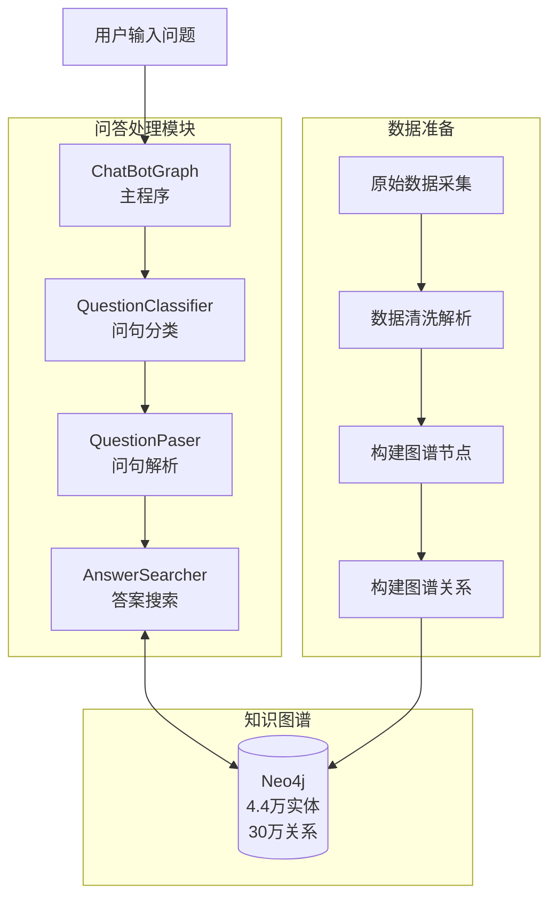
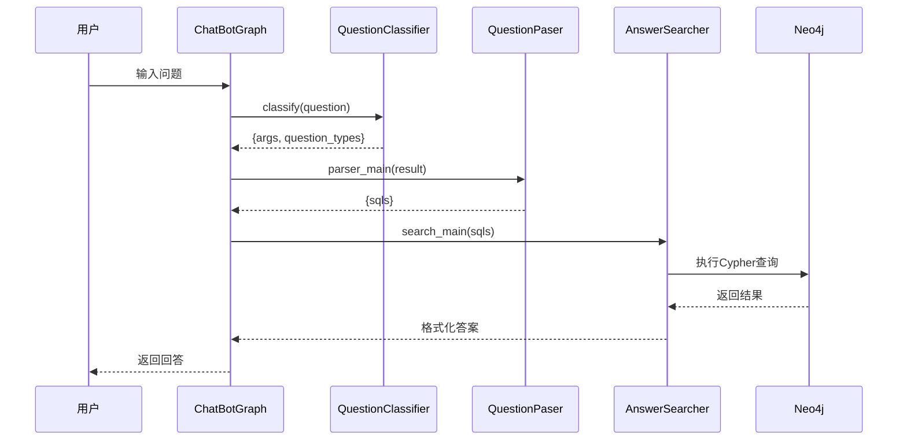
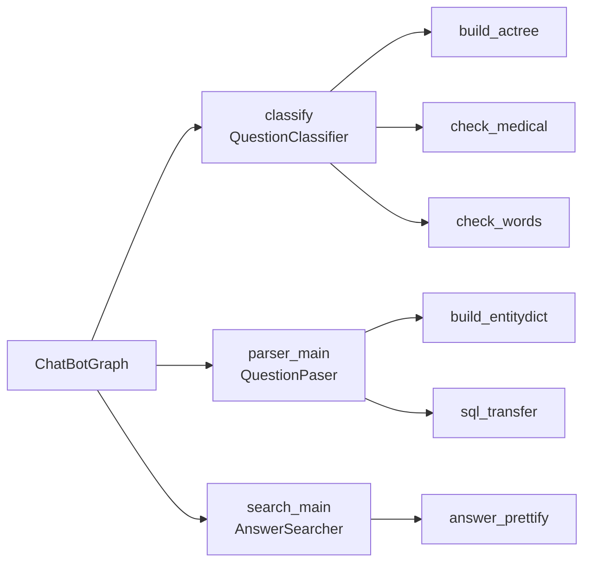

# 01 项目整体架构分析

## 1. 项目概述

这是一个**基于医疗知识图谱的智能问答系统**，由刘焕勇开发。项目实现了从医疗数据采集、知识图谱构建到自动问答的完整流程。

### 核心功能
- 构建以疾病为中心的医疗知识图谱
- 支持18类医疗问题自动回答
- 轻量级、规则驱动的问答系统

---

## 2. 系统整体架构图

### Mermaid流程图


### ASCII架构图
```
┌─────────────────────────────────────────────────────────────────┐
│                      用户输入问题                               │
└────────────────────────┬────────────────────────────────┘
                         │
                         ▼
┌─────────────────────────────────────────────────────────────────┐
│  主程序集成 [chatbot_graph.py]                    │
│  ┌─────────────────────────────────────────────┐  │
│  │    ChatBotGraph                             │  │
│  └─────────────────────────────────────────────┘  │
└──────────┬──────────────────┬──────────────────┬──────────┘
           │                  │                  │
           ▼                  ▼                  ▼
┌───────────────┐    ┌───────────────┐    ┌───────────────┐
│ 问句分类模块  │    │ 问句解析模块  │    │ 答案搜索模块  │
│ (Classifier)│    │  (Parser)   │    │ (Searcher)  │
└───────┬───┘    └───────┬───┘    └───────┬───┘
        │                  │                  │
        ▼                  ▼                  ▼
┌──────────────────┐ ┌──────────────────┐ ┌──────────────────┐
│    实体匹配    │ │  Cypher查询生成 │ │  Neo4j查询执行 │
│  (Aho-Corasick)│ │                  │ │  答案模板化    │
└──────────────────┘ └──────────────────┘ └───────────┬──────┘
                                                           │
                                                           ▼
                                                  ┌──────────┴──────┐
                                                  │   知识图谱    │
                                                  │   (Neo4j)      │
                                                  └───────────────┘
                                                           ▲
                                                           │
┌─────────────────────────────────────────────────────────────────┐
│  数据准备与图谱构建 [build_medicalgraph.py]       │
│  ┌─────────────────────────────────────────────┐  │
│  │  1. 数据采集 (prepare_data/)               │  │
│  │  2. 数据清洗和解析                         │  │
│  │  3. 图谱节点创建                         │  │
│  │  4. 图谱关系创建                         │  │
│  └─────────────────────────────────────────────┘  │
└─────────────────────────────────────────────────────────────────┘
```

---

## 3. 模块划分与职责

| 模块 | 文件 | 核心职责 |
|------|------|---------|
| 主程序 | [chatbot_graph.py](file:///workspace/chatbot_graph.py) | 集成三大模块，协调问答流程 |
| 问句分类 | [question_classifier.py](file:///workspace/question_classifier.py) | 实体识别，问题类型分类 |
| 问句解析 | [question_parser.py](file:///workspace/question_parser.py) | 生成Cypher查询语句 |
| 答案搜索 | [answer_search.py](file:///workspace/answer_search.py) | 执行查询，格式化答案 |
| 知识图谱构建 | [build_medicalgraph.py](file:///workspace/build_medicalgraph.py) | 构建Neo4j知识图谱 |
| 数据准备 | [prepare_data/](file:///workspace/prepare_data/) | 原始数据采集和清洗 |

---

## 4. 详细数据流图

### Mermaid数据流图


### 问答流程数据流
```
用户问题
    │
    │  ┌─────────────────────────┐
    └─▶│   QuestionClassifier   │
       │  1. 实体匹配         │
       │  2. 问题分类         │
       └───────────┬───────────┘
                   │ {args, question_types}
                   ▼
       ┌─────────────────────────┐
       │    QuestionPaser       │
       │  生成Cypher查询       │
       └───────────┬───────────┘
                   │ {sqls}
                   ▼
       ┌─────────────────────────┐
       │    AnswerSearcher      │
       │  1. 执行查询         │
       │  2. 格式化答案       │
       └───────────┬───────────┘
                   │
                   ▼
              最终答案
```

---

## 5. 模块调用关系

### Mermaid调用图


### ASCII调用树
```
ChatBotGraph
    │
    ├── QuestionClassifier.classify()
    │       ├── build_actree()
    │       ├── check_medical()
    │       └── check_words()
    │
    ├── QuestionPaser.parser_main()
    │       ├── build_entitydict()
    │       └── sql_transfer()
    │
    └── AnswerSearcher.search_main()
            ├── search_main()
            └── answer_prettify()
```

---

## 6. 设计理念

### 6.1 业务驱动的知识图谱构建
- 从垂直医疗网站采集数据
- 基于业务需求设计Schema
- 数据结构与问答需求双向验证

### 6.2 基于规则的问答系统
- 优点：
  - 可解释性强
  - 快速实现成本低
  - 结果可控
- 缺点：
  - 规则覆盖有限
  - 难以处理复杂语义

### 6.3 模块解耦设计
三个核心模块完全独立，通过数据结构通信：
- Classifier → {args, question_types}
- Parser → {sqls}
- Searcher → answers

---

## 7. 技术栈分析

| 技术 | 用途 | 说明 |
|-----|------|------|
| Python 3 | 开发语言 | 主要实现语言 |
| Neo4j | 图数据库 | 存储知识图谱 |
| py2neo | Python Neo4j驱动 | 连接和操作图数据库 |
| Aho-Corasick算法 | 多模式匹配 | 快速实体匹配实体词 |
| MongoDB | NoSQL数据库 | 原始数据存储 |
| lxml | HTML解析 | 网页数据采集 |

---

## 8. 问答系统支持的18类问题

1. disease_symptom - 疾病症状
2. symptom_disease - 已知症状找疾病
3. disease_cause - 疾病病因
4. disease_acompany - 疾病并发症
5. disease_not_food - 疾病忌口食物
6. disease_do_food - 疾病推荐食物
7. food_not_disease - 食物不适合的疾病
8. food_do_disease - 食物对什么病好
9. disease_drug - 疾病用什么药
10. drug_disease - 药物治什么病
11. disease_check - 疾病需要什么检查
12. check_disease - 检查能查什么病
13. disease_prevent - 疾病预防
14. disease_lasttime - 治疗周期
15. disease_cureway - 治疗方式
16. disease_cureprob - 治愈概率
17. disease_easyget - 易感人群
18. disease_desc - 疾病描述

---

## 9. 知识图谱规模

| 类型 | 数量 | 说明 |
|-----|------|-----|
| 实体 | 4.4万+ | 7类实体 |
| 关系 | 30万+ | 11类关系 |

---

下一章：[02_数据准备与知识图谱构建模块分析](file:///workspace/ReadCode/02_数据准备与知识图谱构建模块分析.md)
