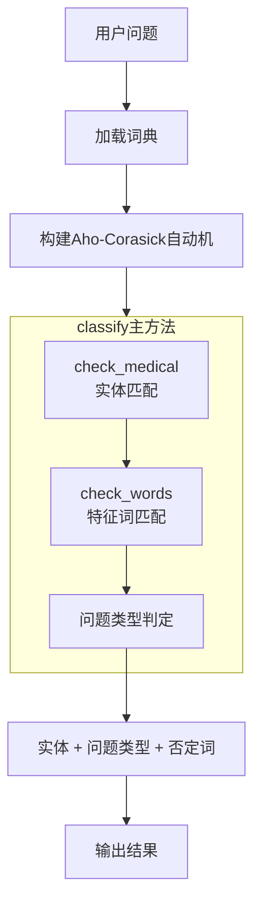
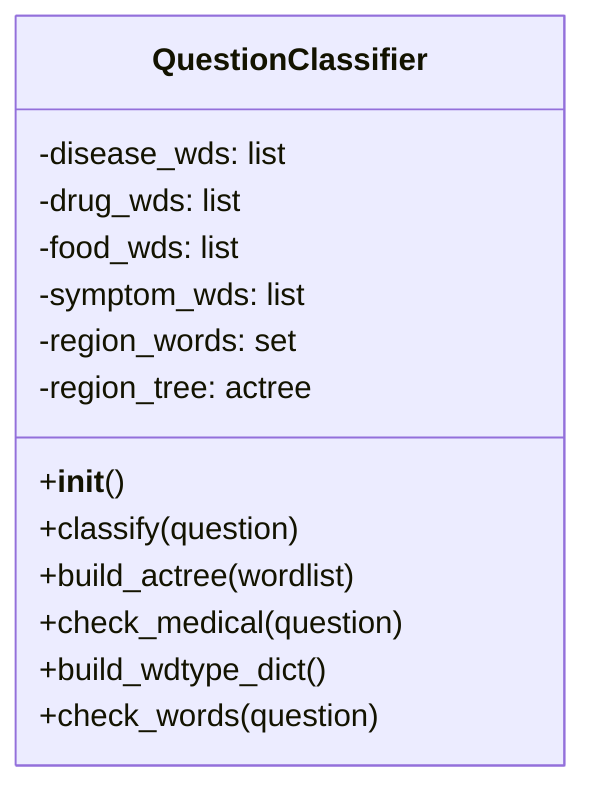

# 03 问句分类模块详细分析

## 1. 模块概述

[question_classifier.py](file:///workspace/question_classifier.py)是问答系统的第一个关键模块，负责：
- 实体识别与匹配
- 问题类型分类
- 否定词检测

### Mermaid分类流程


---

## 2. QuestionClassifier类结构

### Mermaid类图


### ASCII类结构
```
QuestionClassifier
├── __init__()          # 初始化
├── classify()          # 主分类方法
├── build_actree()      # 构建Aho-Corasick自动机
├── check_medical()     # 检测医疗实体
├── build_wdtype_dict() # 构建词-类型字典
└── check_words()       # 检测特征词
```

---

## 3. 初始化详解 ([第11-56行](file:///workspace/question_classifier.py#L11-L56))

### 3.1 加载词典文件
```python
# 加载7类实体词典
self.disease_wds = [line.strip() for line in open('dict/disease.txt')]
self.department_wds = [...]
self.check_wds = [...]
self.drug_wds = [...]
self.food_wds = [...]
self.producer_wds = [...]
self.symptom_wds = [...]

# 合并所有实体词
self.region_words = set(self.department_wds + ...)

# 加载否定词
self.deny_words = [...]
```

### 3.2 构建Aho-Corasick自动机
```python
self.region_tree = self.build_actree(list(self.region_words))
```
用于快速匹配问句中的实体词。

### 3.3 构建词-类型映射
```python
self.wdtype_dict = self.build_wdtype_dict()
```
每个词对应它的实体类型。

### 3.4 定义问题特征词
```python
# 症状疑问词
self.symptom_qwds = ['症状', '表征', '现象', '症候', '表现']

# 病因疑问词
self.cause_qwds = ['原因','成因', '为什么', '怎么会', '怎样才', '咋样才', ...]

# 并发症疑问词
self.acompany_qwds = ['并发症', '并发', '一起发生', '一并发生', ...]

# ... 其他15类问题的特征词
```

---

## 4. Aho-Corasick算法原理

### 4.1 为什么选择Aho-Corasick？
- **多模式匹配**：一次性匹配所有4.4万+实体词
- **线性时间复杂度**：O(n + m)，n=文本长度，m=匹配结果数
- **适合领域实体匹配**：实体词库固定

### 4.2 算法流程
```
构建阶段：
  1. 构建前缀树(Trie)
  2. 构建失败指针(failure link)
  3. 构建输出表

匹配阶段：
  1. 从根节点开始
  2. 逐个字符处理输入文本
  3. 根据当前状态和字符转移
  4. 遇到匹配输出结果
  5. 失败时沿失败指针跳转
```

### 4.3 代码实现 ([第191-196行](file:///workspace/question_classifier.py#L191-L196))
```python
def build_actree(self, wordlist):
    actree = ahocorasick.Automaton()
    for index, word in enumerate(wordlist):
        actree.add_word(word, (index, word))
    actree.make_automaton()
    return actree
```

---

## 5. 实体匹配 check_medical() ([第199-212行](file:///workspace/question_classifier.py#L199-L212))

### 5.1 匹配流程
```python
def check_medical(self, question):
    # Step 1: 使用AC自动机匹配所有可能的实体
    region_wds = []
    for i in self.region_tree.iter(question):
        wd = i[1][1]
        region_wds.append(wd)
    
    # Step 2: 去重，保留最长匹配
    stop_wds = []
    for wd1 in region_wds:
        for wd2 in region_wds:
            if wd1 in wd2 and wd1 != wd2:
                stop_wds.append(wd1)
    final_wds = [i for i in region_wds if i not in stop_wds]
    
    # Step 3: 构建实体-类型映射
    final_dict = {i: self.wdtype_dict.get(i) for i in final_wds}
    return final_dict
```

### 5.2 最长匹配策略
- 问题："急性支气管炎" → 可能匹配到"急性"和"急性支气管炎"
- 解决：如果短词是长词的子串，则只保留长词

---

## 6. 问题分类 classify() ([第61-167行](file:///workspace/question_classifier.py#L61-L167))

### 6.1 分类流程
```
1. 检测实体 → medical_dict
2. 如果没有实体 → 返回空
3. 收集实体类型 types
4. 逐一检查18类问题特征词
5. 返回 {args, question_types}
```

### 6.2 分类规则示例
```python
# 疾病症状类问题
if self.check_words(self.symptom_qwds, question) and ('disease' in types):
    question_type = 'disease_symptom'
    question_types.append(question_type)

# 症状对应疾病
if self.check_words(self.symptom_qwds, question) and ('symptom' in types):
    question_type = 'symptom_disease'
    question_types.append(question_type)

# 否定词检测（用于区分宜吃/忌食）
if self.check_words(self.food_qwds, question) and 'disease' in types:
    deny_status = self.check_words(self.deny_words, question)
    if deny_status:
        question_type = 'disease_not_food'  # 忌口
    else:
        question_type = 'disease_do_food'    # 宜吃
    question_types.append(question_type)
```

### 6.3 回退机制
如果没有匹配到任何问题类型但有实体：
- 有疾病实体 → 默认返回疾病描述
- 有症状实体 → 默认返回症状对应疾病

---

## 7. 词类型字典 build_wdtype_dict() ([第170-188行](file:///workspace/question_classifier.py#L170-L188))

```python
def build_wdtype_dict(self):
    wd_dict = dict()
    for wd in self.region_words:
        wd_dict[wd] = []
        if wd in self.disease_wds:
            wd_dict[wd].append('disease')
        if wd in self.department_wds:
            wd_dict[wd].append('department')
        # ... 其他类型
    return wd_dict
```

**注意**：一个词可能属于多种类型，所以用列表存储。

---

## 8. 输出数据结构

```python
{
    'args': {
        '感冒': ['disease'],
        '咳嗽': ['symptom']
    },
    'question_types': ['disease_symptom']
}
```

---

## 9. 示例

**输入**："感冒有什么症状？"

**处理过程**：
1. 实体匹配：识别出"感冒"
2. 特征词匹配："症状"匹配symptom_qwds
3. 类型检查："感冒"是disease
4. 分类结果：disease_symptom

**输出**：
```python
{
    'args': {'感冒': ['disease']},
    'question_types': ['disease_symptom']
}
```

---

下一章：[04_问句解析模块详细分析](file:///workspace/ReadCode/04_问句解析模块详细分析.md)
