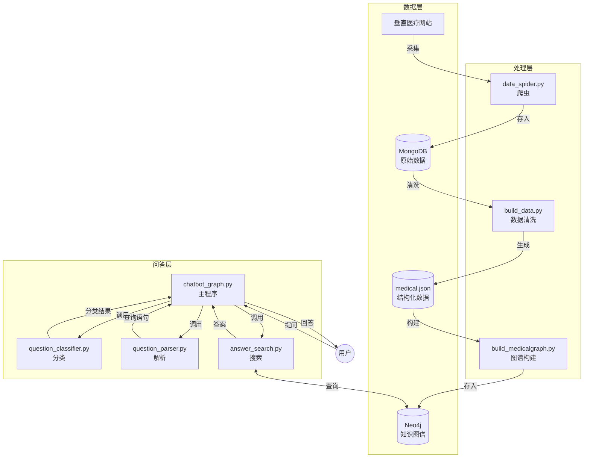

# 09 系统总结与优化建议

## 1. 项目总结

### Mermaid系统全景图


### 1.1 项目亮点

1. **完整的知识图谱问答流程**
   - 从数据采集到问答服务完整实现
   - 数据、图谱、问答三部分齐全

2. **高效的实体匹配**
   - 使用Aho-Corasick算法实现多模式匹配
   - 4.4万实体词在线性时间内完成匹配

3. **清晰的模块设计**
   - 分类、解析、搜索三大模块解耦
   - 易于理解、维护和扩展

4. **实用的医疗场景**
   - 真实医疗数据
   - 支持18类常见医疗问题

### 1.2 项目规模

| 指标 | 数值 |
|-----|-----|
| 疾病数量 | 8,807 |
| 实体总数 | 约4.4万 |
| 关系总数 | 约30万 |
| 问题类型 | 18类 |
| 核心代码量 | 约600行 |

---

## 2. 系统优点

### 2.1 设计优点

1. **模块化**
   - 各模块独立，职责清晰
   - 便于单独测试和维护

2. **规则驱动**
   - 可解释性强
   - 调试和问题排查方便
   - 结果可控

3. **轻量级**
   - 代码简洁
   - 资源消耗小
   - 部署方便

4. **数据完整**
   - Schema设计合理
   - 实体、属性、关系齐全

### 2.2 技术优点

1. **AC算法效率高**
   - 处理4.4万实体词不在话下
   - 实际问答响应快

2. **图数据库天然优势**
   - 关系查询高效
   - Schema灵活

---

## 3. 局限性分析

### 3.1 规则系统的局限性

1. **覆盖范围有限**
   - 仅支持18类固定问题
   - 无法处理超出规则的问题
   - 对自然语言多样性支持不足

2. **特征词匹配简单**
   - 仅使用精确匹配
   - 无法处理同义词、近义词
   - 对语义变化不鲁棒

3. **无上下文理解**
   - 单轮对话，无法联系上下文
   - 无法处理指代消解
   - 无法追问

### 3.2 功能局限性

1. **无用户画像**
   - 无法根据用户情况个性化
   - 年龄、病史等不考虑

2. **无置信度**
   - 答案没有可信度评分
   - 用户无法判断可靠性

3. **无反馈机制**
   - 用户无法纠正错误
   - 系统无法从错误中学习

### 3.3 技术债务

1. **硬编码配置**
   - Neo4j连接信息直接写死
   - 用户名密码明文存储
   - 应使用配置文件

2. **无日志系统**
   - 无查询日志
   - 无错误日志
   - 问题排查困难

3. **无测试用例**
   - 单元测试缺失
   - 集成测试缺失
   - 回归测试困难

---

## 4. 优化建议

### 4.1 短期优化（1-2周）

#### 4.1.1 工程化改进

1. **配置管理**
```python
# config.py
NEO4J_CONFIG = {
    'host': 'localhost',
    'port': 7474,
    'user': os.getenv('NEO4J_USER', 'neo4j'),
    'password': os.getenv('NEO4J_PASSWORD', 'password')
}
```

2. **日志系统**
```python
import logging
logging.basicConfig(level=logging.INFO)
logger = logging.getLogger(__name__)
```

3. **异常处理增强**
```python
try:
    result = self.g.run(query)
except Exception as e:
    logger.error(f"Query failed: {query}, error: {e}")
    return []
```

#### 4.1.2 规则增强

1. **同义词扩展**
```python
# 添加同义词词典
symptom_synonyms = {
    '发热': ['发烧', '高烧', '低烧'],
    '咳嗽': ['干咳', '咳嗽不止']
}
```

2. **模糊匹配**
```python
# 使用编辑距离、拼音模糊匹配等
```

### 4.2 中期优化（1-2月）

#### 4.2.1 引入机器学习

1. **问题分类**
```
传统规则 → 深度学习分类器
输入: 问句文本
输出: 问题类型分布
```

2. **实体识别**
```
AC匹配 → BiLSTM-CRF / BERT
更好地处理未登录词
```

3. **语义匹配**
```
召回+排序架构
向量相似度计算
```

#### 4.2.2 多轮对话

```python
class DialogueManager:
    def __init__(self):
        self.history = []
        
    def update(self, user_utterance, system_response):
        self.history.append({
            'user': user_utterance,
            'system': system_response
        })
        
    def get_context(self):
        # 返回最近N轮对话
        return self.history[-3:]
```

### 4.3 长期优化（3月+）

#### 4.3.1 架构升级

1. **微服务化**
```
前端服务 → 问答服务 → 图谱服务
              ↓
          NLP服务
```

2. **缓存层**
```
Redis缓存常见问题答案
QPS提升10倍+
```

3. **负载均衡**
```
多实例部署
保证高可用
```

#### 4.3.2 知识增强

1. **知识更新**
```
定期增量更新
支持动态添加新知识
```

2. **知识验证**
```
多源数据交叉验证
置信度评分
```

3. **知识推理**
```
规则推理
图谱表示学习
```

---

## 5. 学习建议

### 5.1 入门路径

1. **理解整体流程**
   - 先看chatbot_graph.py了解主流程
   - 再分别看三个核心模块

2. **跑通系统**
   - 安装Neo4j
   - 导入数据构建图谱
   - 启动问答服务

3. **实验修改**
   - 修改规则观察效果
   - 添加新的问题类型
   - 尝试自己的数据

### 5.2 进阶方向

1. **NLP方向**
   - 阅读理解
   - 语义解析
   - 对话系统

2. **知识图谱方向**
   - 知识图谱构建
   - 知识图谱问答
   - 知识图谱推理

3. **工程方向**
   - 高并发服务
   - 微服务架构
   - 缓存设计

---

## 6. 总结

这个项目是一个**优秀的知识图谱问答入门项目**：
- ✅ 代码结构清晰
- ✅ 注释详细
- ✅ 数据完整
- ✅ 实用性强
- ⚠️ 有局限性，但适合学习

通过这个项目可以学习到：
- 知识图谱构建
- 基于规则的问答系统
- 图数据库使用
- NLP基础技术

在此基础上可以继续优化和扩展，是很好的学习起点！

---

## 附：完整分析文档索引

| 序号 | 文档 | 内容 |
|-----|------|-----|
| 1 | 01_项目整体架构分析.md | 系统架构、设计理念、技术栈 |
| 2 | 02_数据准备与知识图谱构建模块分析.md | 数据流程、图谱Schema |
| 3 | 03_问句分类模块详细分析.md | 实体匹配、问题分类、AC算法 |
| 4 | 04_问句解析模块详细分析.md | Cypher查询生成 |
| 5 | 05_答案搜索模块详细分析.md | 查询执行、答案格式化 |
| 6 | 06_主程序集成分析.md | 模块集成、完整流程 |
| 7 | 07_数据结构与词典分析.md | 数据格式、词典说明 |
| 8 | 08_算法与技术原理.md | 算法深入解析 |
| 9 | 09_系统总结与优化建议.md | 总结与展望 |
| 10 | 10_代码文件详解/ | 逐文件详细代码解析 |

---

**分析完成！** 请查看 `ReadCode/` 目录下的所有文档获取完整分析。
