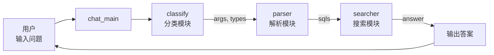

# chatbot_graph.py 详细代码解析

## 文件信息
- **文件名**: chatbot_graph.py
- **功能**: 主程序入口，集成三大模块
- **行数**: 35行
- **核心类**: ChatBotGraph

### Mermaid主程序流程图


---

## 完整代码

```python
#!/usr/bin/env python3
# coding: utf-8
# File: chatbot_graph.py
# Author: lhy<lhy_in_blcu@126.com,https://huangyong.github.io>
# Date: 18-10-4

from question_classifier import *
from question_parser import *
from answer_search import *

'''问答类'''
class ChatBotGraph:
    def __init__(self):
        self.classifier = QuestionClassifier()
        self.parser = QuestionPaser()
        self.searcher = AnswerSearcher()

    def chat_main(self, sent):
        answer = '您好，我是小勇医药智能助理，希望可以帮到您。如果没答上来，可联系https://liuhuanyong.github.io/。祝您身体棒棒！'
        res_classify = self.classifier.classify(sent)
        if not res_classify:
            return answer
        res_sql = self.parser.parser_main(res_classify)
        final_answers = self.searcher.search_main(res_sql)
        if not final_answers:
            return answer
        else:
            return '\n'.join(final_answers)

if __name__ == '__main__':
    handler = ChatBotGraph()
    while 1:
        question = input('用户:')
        answer = handler.chat_main(question)
        print('小勇:', answer)
```

---

## 逐行详细解析

### 1. 头部注释 (1-6行)
```python
#!/usr/bin/env python3
# coding: utf-8
# File: chatbot_graph.py
# Author: lhy<lhy_in_blcu@126.com,https://huangyong.github.io>
# Date: 18-10-4
```

**解析**:
- `#!/usr/bin/env python3`: Shebang，指定使用Python 3解释器
- `# coding: utf-8`: 指定文件编码为UTF-8，支持中文
- 其他为作者和文件信息

### 2. 导入模块 (8-10行)
```python
from question_classifier import *
from question_parser import *
from answer_search import *
```

**解析**:
- 导入三个核心模块
- 使用`*`导入所有内容（实际工程中不推荐，可能导致命名冲突）
- 模块依赖关系:
  ```
  chatbot_graph.py
    ├── question_classifier.py
    ├── question_parser.py
    └── answer_searcher.py
  ```

### 3. ChatBotGraph 类定义 (13-28行)

#### 3.1 __init__ 初始化方法 (14-16行)
```python
def __init__(self):
    self.classifier = QuestionClassifier()
    self.parser = QuestionPaser()
    self.searcher = AnswerSearcher()
```

**解析**:
- 初始化三个核心组件
- 顺序加载，因为这三个组件的初始化可能需要一些时间（如加载词典、构建AC自动机等）
- **设计模式**: 组合模式，将三个对象组合成一个更大的对象

#### 3.2 chat_main 主问答方法 (18-28行)
```python
def chat_main(self, sent):
    answer = '您好，我是小勇医药智能助理，希望可以帮到您。如果没答上来，可联系https://liuhuanyong.github.io/。祝您身体棒棒！'
    res_classify = self.classifier.classify(sent)
    if not res_classify:
        return answer
    res_sql = self.parser.parser_main(res_classify)
    final_answers = self.searcher.search_main(res_sql)
    if not final_answers:
        return answer
    else:
        return '\n'.join(final_answers)
```

**详细流程解析**:

| 步骤 | 代码 | 说明 | 数据结构 |
|-----|------|-----|---------|
| 1 | `answer = '...'` | 默认回复，兜底策略 | String |
| 2 | `res_classify = ...` | 调用分类器 | {'args': {}, 'question_types': []} |
| 3 | `if not res_classify` | 分类失败检查 | - |
| 4 | `res_sql = ...` | 调用解析器生成Cypher | [{'question_type': '', 'sql': []}] |
| 5 | `final_answers = ...` | 执行查询并格式化 | [answer1, answer2, ...] |
| 6 | `if not final_answers` | 结果为空检查 | - |
| 7 | `'\n'.join(...)` | 多个答案用换行连接 | String |

**数据流向图**:
```
用户问句 (sent)
    ↓
[分类器] → {args, question_types}
    ↓
[解析器] → [{question_type, sql}]
    ↓
[搜索器] → [answer1, answer2, ...]
    ↓
join → 最终回答
```

### 4. 主程序入口 (30-35行)
```python
if __name__ == '__main__':
    handler = ChatBotGraph()
    while 1:
        question = input('用户:')
        answer = handler.chat_main(question)
        print('小勇:', answer)
```

**解析**:

#### 4.1 初始化 (31行)
```python
handler = ChatBotGraph()
```
- 创建ChatBotGraph实例
- 这会触发三个子模块的初始化（可能耗时几秒）

#### 4.2 主循环 (32-35行)
```python
while 1:
    question = input('用户:')
    answer = handler.chat_main(question)
    print('小勇:', answer)
```

**循环解析**:
- `while 1`: 无限循环（等价于`while True`）
- `input('用户:')`: 从标准输入读取用户问题
- `handler.chat_main(question)`: 处理问题
- `print('小勇:', answer)`: 输出回答

**会话示例**:
```
用户:感冒有什么症状？
小勇: 感冒的症状包括：咳嗽；流鼻涕；发热
用户:
```

---

## 设计模式与架构思想

### 1. 门面模式 (Facade Pattern)

ChatBotGraph作为门面，隐藏子系统的复杂性：
```
┌─────────────────────────────────────────┐
│         ChatBotGraph (Facade)            │
│  ┌─────────────────────────────────┐   │
│  │  - classify()                   │   │
│  │  - parser_main()                │   │
│  │  - search_main()                │   │
│  └─────────────────────────────────┘   │
└─────────────────────────────────────────┘
           │
    ┌──────┴──────┬────────┐
    ▼             ▼        ▼
Classifier   Parser    Searcher
```

**优点**:
- 简化了客户端代码
- 客户端只需要和门面交互
- 子系统变化不影响客户端

### 2. 责任链 (Chain of Responsibility)

处理流程像一个链条：
```
问题 → 分类 → 解析 → 搜索 → 答案
```

每个环节只处理自己负责的部分。

---

## 代码优化建议

### 1. 更好的模块导入

**当前**:
```python
from question_classifier import *
```

**建议**:
```python
from question_classifier import QuestionClassifier
from question_parser import QuestionPaser
from answer_search import AnswerSearcher
```

**原因**: 避免命名空间污染，明确导入内容

### 2. 添加异常处理

**建议**:
```python
def chat_main(self, sent):
    try:
        answer = DEFAULT_ANSWER
        # ... 原有代码
    except Exception as e:
        logger.error(f"Error: {e}")
        return DEFAULT_ANSWER
```

### 3. 添加退出条件

**建议**:
```python
while 1:
    question = input('用户:')
    if question.lower() in ['quit', 'exit', 'q', '退出']:
        print('再见！')
        break
    # ... 原有代码
```

### 4. 使用配置文件

**建议**:
```python
import config
DEFAULT_ANSWER = config.DEFAULT_ANSWER
BOT_NAME = config.BOT_NAME
```

---

## 总结

这个文件虽然只有35行，但它是整个系统的入口：
- ✅ 清晰简洁
- ✅ 职责单一
- ✅ 易于理解
- ⚠️ 缺少错误处理
- ⚠️ 缺少日志记录

它展示了好的代码组织方式的例子：**高内聚，低耦合**。
