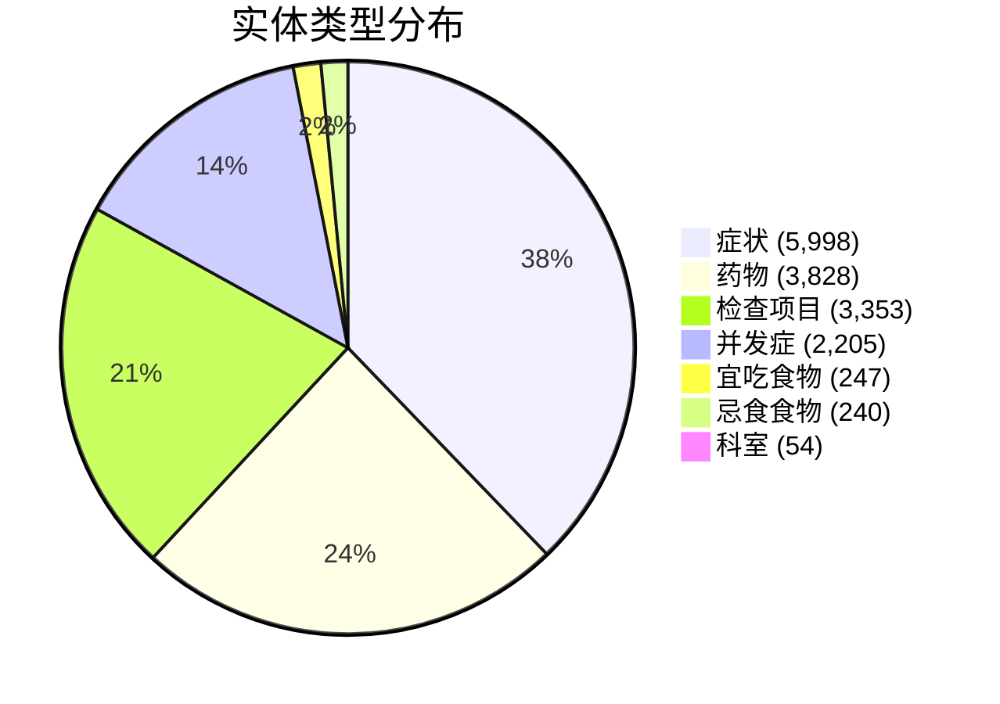
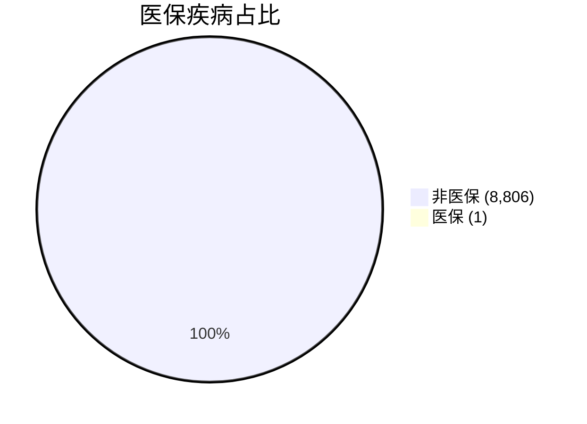

# medical.json 数据分析报告

## 一、数据概览

| 指标 | 数值 |
|-----|-----|
| **文件大小** | 45 MB |
| **疾病总数** | 8,808 条 |
| **数据格式** | JSON Lines (每行一条疾病数据) |
| **字段数** | 23 个 |

---

## 二、字段完整性统计

| 字段 | 出现次数 | 覆盖率 | 说明 |
|-----|---------|-------|------|
| `_id` | 8,808 | 100.0% | MongoDB 的 ObjectID |
| `name` | 8,808 | 100.0% | 疾病名称 |
| `desc` | 8,808 | 100.0% | 疾病描述 |
| `category` | 8,808 | 100.0% | 疾病分类（列表） |
| `prevent` | 8,808 | 100.0% | 预防措施 |
| `cause` | 8,808 | 100.0% | 病因 |
| `symptom` | 8,808 | 100.0% | 症状（列表） |
| `check` | 8,808 | 100.0% | 检查项目（列表） |
| `recommand_drug` | 8,808 | 100.0% | 推荐药物（列表） |
| `drug_detail` | 8,808 | 100.0% | 药物详情（列表） |
| `yibao_status` | 8,807 | 100.0% | 医保状态 |
| `acompany` | 8,807 | 100.0% | 并发症（列表） |
| `cure_department` | 8,807 | 100.0% | 就诊科室（列表） |
| `cost_money` | 8,807 | 100.0% | 治疗费用 |
| `get_prob` | 8,806 | 100.0% | 患病概率 |
| `get_way` | 8,806 | 100.0% | 传播途径 |
| `cure_way` | 8,806 | 100.0% | 治疗方式（列表） |
| `cure_lasttime` | 8,806 | 100.0% | 治疗周期 |
| `cured_prob` | 8,806 | 100.0% | 治愈概率 |
| `easy_get` | 8,804 | 100.0% | 易感人群 |
| `common_drug` | 7,645 | 86.8% | 常用药物（列表） |
| `do_eat` | 5,576 | 63.3% | 宜吃食物（列表） |
| `not_eat` | 5,576 | 63.3% | 忌食食物（列表） |
| `recommand_eat` | 5,576 | 63.3% | 推荐食谱（列表） |

---

## 三、实体数量统计



| 实体类型 | 数量 |
|---------|-----|
| **症状** | 5,998 |
| **药物** | 3,828 |
| **检查项目** | 3,353 |
| **并发症** | 2,205 |
| **宜吃食物** | 247 |
| **忌食食物** | 240 |
| **科室** | 54 |

---

## 四、列表字段元素分布

### 4.1 症状 (symptom)

| 统计项 | 数值 |
|-------|-----|
| 平均元素数 | 6.2 个/疾病 |
| 最多症状数 | 12 个 |
| 最少症状数 | 0 个 |
| 无症状的疾病数 | 43 |

分布（前10名）：
| 症状数 | 疾病数 |
|-------|-------|
| 0 | 43 |
| 1 | 225 |
| 2 | 516 |
| 3 | 894 |
| 4 | 1,050 |
| 5 | 1,008 |
| 6 | 938 |
| 7 | 888 |
| 8 | 926 |
| 9 | 1,131 |

---

### 4.2 并发症 (acompany)

| 统计项 | 数值 |
|-------|-----|
| 平均元素数 | 1.4 个/疾病 |
| 最多并发症数 | 28 个 |
| 最少并发症数 | 0 个 |
| 无并发症的疾病数 | 283 |

---

### 4.3 常用药物 (common_drug)

| 统计项 | 数值 |
|-------|-----|
| 平均元素数 | 1.7 个/疾病 |
| 最多药物数 | 4 个 |
| 最少药物数 | 0 个 |
| 无常用药的疾病数 | 1,163 |

---

### 4.4 推荐药物 (recommand_drug)

| 统计项 | 数值 |
|-------|-----|
| 平均元素数 | 6.8 个/疾病 |
| 最多药物数 | 23 个 |
| 最少药物数 | 0 个 |

---

### 4.5 检查项目 (check)

| 统计项 | 数值 |
|-------|-----|
| 平均元素数 | 4.5 个/疾病 |
| 最多检查数 | 10 个 |
| 最少检查数 | 0 个 |
| 无检查的疾病数 | 4 |

---

### 4.6 就诊科室 (cure_department)

| 统计项 | 数值 |
|-------|-----|
| 平均元素数 | 1.9 个/疾病 |
| 最多科室数 | 2 个 |
| 最少科室数 | 0 个 |
| 无科室的疾病数 | 1 |

分布：
| 科室数 | 疾病数 |
|-------|-------|
| 0 | 1 |
| 1 | 831 |
| 2 | 7,976 |

---

## 五、分类字段值分布

### 5.1 医保状态 (yibao_status)



| 医保状态 | 疾病数 |
|---------|-------|
| 否 | 8,806 |
| 是 | 1 |

---

### 5.2 易感人群 (easy_get)

| 易感人群 | 疾病数 |
|---------|-------|
| 无特殊人群 | 2,142 |
| 无特定人群 | 1,991 |
| 儿童 | 747 |
| 无特发人群 | 518 |
| 无特定的人群 | 481 |
| 女性 | 293 |
| 老年人 | 225 |
| 婴幼儿 | 143 |
| 男性 | 112 |
| 幼儿 | 89 |

---

### 5.3 治疗周期 (cure_lasttime) - Top 10

| 治疗周期 | 疾病数 |
|---------|-------|
| 1-3个月 | 1,282 |
| 3-6个月 | 606 |
| 2-4周 | 556 |
| 3个月 | 467 |
| 1-2个月 | 447 |
| 7-14天 | 248 |
| 30天 | 224 |
| 2-4月 | 209 |
| 10-30天 | 205 |
| 3-6月 | 179 |

---

### 5.4 治愈率 (cured_prob) - Top 10

| 治愈率 | 疾病数 |
|-------|-------|
| 80% | 1,089 |
| 60% | 867 |
| 70% | 771 |
| 90% | 509 |
| 85% | 436 |
| 75% | 431 |
| 40% | 393 |
| 30% | 350 |
| 95% | 332 |
| 50% | 269 |

---

## 六、数据示例

### 疾病：肺泡蛋白质沉积症

```python
{
  "_id": {"$oid": "5bb578b6831b973a137e3ee6"},
  "name": "肺泡蛋白质沉积症",
  "category": ["疾病百科", "内科", "呼吸内科"],
  "desc": "肺泡蛋白质沉积症(简称PAP)，又称Rosen-Castle-man-Liebow综合征，是一种罕见...",
  "cause": "病因未明，推测与几方面因素有关：如大量粉尘吸入（铝，二氧化硅等），机体免疫功能下降（尤其婴幼儿），遗传...",
  "prevent": "1、避免感染分支杆菌病，卡氏肺囊肿肺炎，巨细胞病毒等。\n2、注意锻炼身体，提高免疫力。",
  "symptom": ["紫绀", "胸痛", "呼吸困难", "乏力", "毓卓"],
  "check": ["胸部CT检查", "肺活检", "支气管镜检查"],
  "cure_department": ["内科", "呼吸内科"],
  "cure_way": ["支气管肺泡灌洗"],
  "cure_lasttime": "约3个月",
  "cured_prob": "约40%",
  "get_prob": "0.00002%",
  "get_way": "无传染性",
  "easy_get": "",
  "acompany": ["多重肺部感染"],
  "common_drug": [],
  "recommand_drug": [],
  "drug_detail": [],
  "do_eat": [],
  "not_eat": [],
  "recommand_eat": [],
  "yibao_status": "否",
  "cost_money": "根据不同医院，收费标准不一致，省市三甲医院约（ 8000——15000 元）"
}
```

---

## 七、与知识图谱的对应关系

| medical.json 字段 | 知识图谱类型 | 说明 |
|-----------------|-----------|------|
| `name` | Disease 节点 | 疾病名称 |
| `desc`, `cause`, `prevent`, `cure_lasttime`, `cured_prob`, `easy_get`, `get_prob`, `get_way`, `cost_money` | Disease 属性 | 疾病的文本属性 |
| `symptom` | Symptom 节点 + has_symptom 关系 | 症状节点 |
| `check` | Check 节点 + need_check 关系 | 检查项目节点 |
| `common_drug`, `recommand_drug`, `drug_detail` | Drug 节点 + common_drug/recommand_drug 关系 | 药物节点 |
| `do_eat`, `not_eat`, `recommand_eat` | Food 节点 + do_eat/not_eat/recommand_eat 关系 | 食物节点 |
| `acompany` | Disease 节点 + acompany_with 关系 | 并发症（指向其他疾病） |
| `cure_department` | Department 节点 + belongs_to 关系 | 科室节点 |
| `category` | Department 节点 + belongs_to 关系 | 分类科室 |

---

## 八、数据特点总结

1. **完整性好**：核心字段（名称、描述、症状、检查等）覆盖率 100%
2. **结构化程度高**：列表类型字段清晰，便于图谱构建
3. **分类标签统一**：治愈率、治疗周期有相对标准化的文本格式
4. **中文语料**：所有数据均为中文，适合中文 NLP 应用
5. **实际医疗数据**：从垂直医疗网站爬取，具有实用性

---

## 九、生成的文件

- **分析脚本**: [analyze_medical_json.py](file:///workspace/analyze_medical_json.py)
- **统计结果**: [medical_data_summary.json](file:///workspace/medical_data_summary.json)
- **原始数据**: [data/medical.json](file:///workspace/data/medical.json)

---

**报告生成时间**: 2026-05-13
