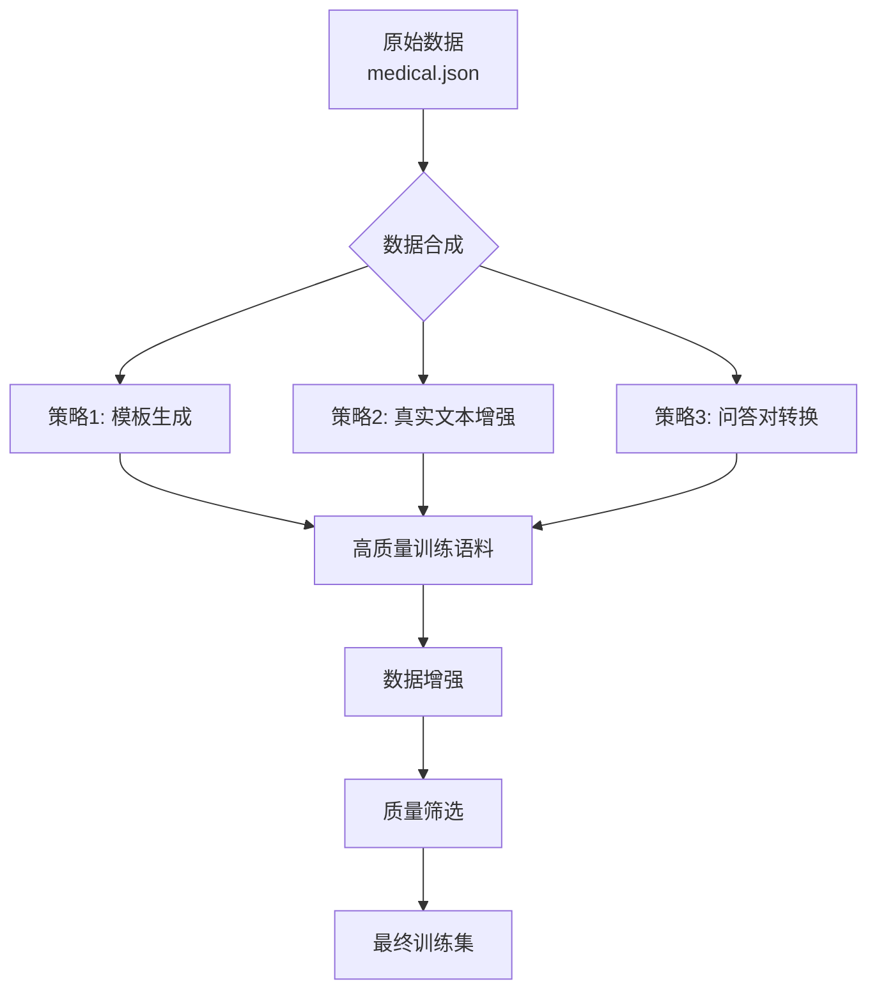
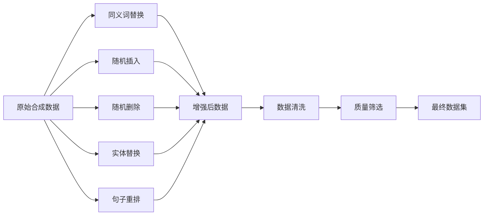
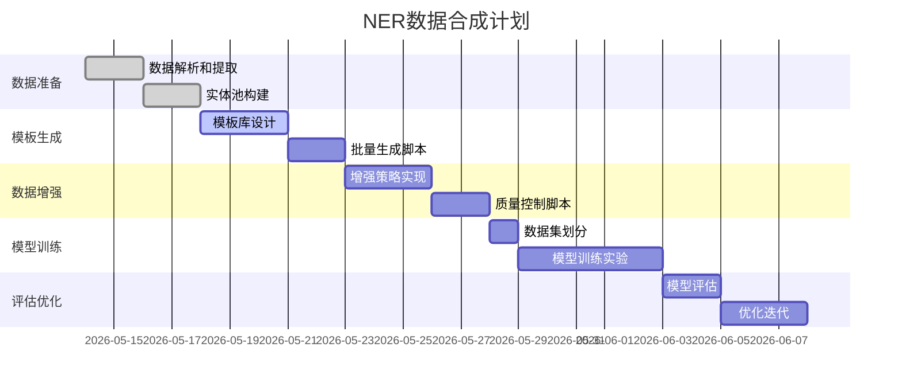

# 医疗NER模型训练数据合成方案

## 项目背景

基于 `medical.json` 中的疾病-症状关系数据，设计一套数据合成方案，用于训练**疾病实体**和**症状实体**的命名实体识别（NER）模型。

---

## 一、数据分析

### 1.1 现有数据资源

| 数据项 | 数量 | 说明 |
|--------|------|------|
| 疾病实体 | 8,808 | 带完整属性 |
| 症状实体 | 5,998 | 独立症状词 |
| 疾病-症状关系 | ~54,000 | 每疾病平均6.2个症状 |
| 其他实体 | 7,421 | 药物、检查、食物等 |

### 1.2 数据质量评估

**优势：**
- ✅ 结构化程度高（JSON Lines格式）
- ✅ 疾病-症状关系完整
- ✅ 中文医疗术语准确
- ✅ 覆盖范围广（8,808种疾病）

**局限性：**
- ⚠️ 缺乏句子级别的上下文
- ⚠️ 缺乏真实问句形式
- ⚠️ 症状表达较为独立
- ⚠️ 无标注边界信息

---

## 二、NER标签体系设计

### 2.1 标签定义

采用 **BIOES** 标注体系：

| 标签 | 含义 | 示例 |
|------|------|------|
| **B-Disease** | 疾病实体开始 | [疾病开始 |
| **I-Disease** | 疾病实体延续 | 疾病延续] |
| **E-Disease** | 疾病实体结束 | 疾病结束] |
| **S-Disease** | 单字疾病实体 | 癌 |
| **B-Symptom** | 症状实体开始 | [症状开始 |
| **I-Symptom** | 症状实体延续 | 症状延续] |
| **E-Symptom** | 症状实体结束 | 症状结束] |
| **S-Symptom** | 单字症状实体 | 痛 |
| **O** | 非实体 | 其他 |

### 2.2 标注规范

```
示例句子: "肺癌的常见症状是咳嗽和胸痛"

标注结果:
- 癌: S-Disease  (单字疾病)
- 的: O
- 常见: O
- 症状: O
- 是: O
- 咳: B-Symptom
- 嗽: E-Symptom
- 和: O
- 胸: B-Symptom
- 痛: E-Symptom
```

### 2.3 实体类型说明

| 实体类型 | 定义 | 边界判断标准 |
|----------|------|-------------|
| Disease | 疾病名称 | 按 `name` 字段确定 |
| Symptom | 症状表现 | 按 `symptom` 字段确定 |

---

## 三、数据合成策略

### 3.1 策略概览



### 3.2 策略一：模板生成法

#### 3.2.1 句子模板库

**疾病相关模板（30+句式）：**

```python
disease_templates = [
    "{disease}是什么原因引起的？",
    "{disease}有哪些症状？",
    "{disease}怎么治疗？",
    "{disease}需要做什么检查？",
    "{disease}吃什么药好？",
    "{disease}忌口什么？",
    "得了{disease}怎么办？",
    "我好像有{disease}，怎么办？",
    "请问{disease}严重吗？",
    "{disease}会传染吗？",
    "哪些人容易得{disease}？",
    "{disease}能治好吗？",
    "{disease}治愈率是多少？",
    "{disease}治疗需要多久？",
    "{disease}会复发吗？",
]
```

**症状相关模板（20+句式）：**

```python
symptom_templates = [
    "{symptom}是什么原因？",
    "出现{symptom}是得了什么病？",
    "{symptom}怎么缓解？",
    "{symptom}吃什么药？",
    "我最近总是{symptom}，怎么办？",
    "{symptom}是不是生病了？",
    "持续{symptom}是怎么回事？",
    "突然{symptom}是什么情况？",
    "{symptom}应该如何处理？",
    "{symptom}需要看医生吗？",
]
```

**疾病-症状关联模板（50+句式）：**

```python
disease_symptom_templates = [
    "{disease}的常见症状包括{symptom}吗？",
    "{disease}会不会引起{symptom}？",
    "{disease}的症状有{symptom}吗？",
    "得了{disease}会出现{symptom}吗？",
    "{disease}通常表现为{symptom}吗？",
    "{symptom}是{disease}的表现吗？",
    "{disease}会导致{symptom}吗？",
    "{disease}患者会有{symptom}的症状吗？",
    "如果有{symptom}，是不是{disease}？",
    "{disease}的主要症状是{symptom}吗？",
]
```

#### 3.2.2 模板使用规则

```python
class TemplateGenerator:
    """模板生成器"""
    
    def __init__(self, diseases, symptoms, relations):
        self.diseases = diseases
        self.symptoms = symptoms
        self.relations = relations  # {disease: [symptoms]}
        
    def generate_disease_queries(self):
        """生成疾病相关问句"""
        results = []
        for disease in self.diseases:
            for template in disease_templates:
                sentence = template.format(disease=disease)
                # 标注疾病实体
                labels = self._label_disease(sentence, disease)
                results.append({
                    'text': sentence,
                    'labels': labels
                })
        return results
    
    def generate_symptom_queries(self):
        """生成症状相关问句"""
        results = []
        for symptom in self.symptoms:
            for template in symptom_templates:
                sentence = template.format(symptom=symptom)
                labels = self._label_symptom(sentence, symptom)
                results.append({
                    'text': sentence,
                    'labels': labels
                })
        return results
    
    def generate_relation_queries(self):
        """生成疾病-症状关联问句"""
        results = []
        for disease, symptom_list in self.relations.items():
            for symptom in symptom_list:
                for template in disease_symptom_templates:
                    sentence = template.format(
                        disease=disease,
                        symptom=symptom
                    )
                    labels = self._label_both(
                        sentence, disease, symptom
                    )
                    results.append({
                        'text': sentence,
                        'labels': labels
                    })
        return results
```

#### 3.2.3 生成规模估算

| 模板类型 | 模板数 | 实体数 | 生成数量 |
|----------|--------|--------|----------|
| 疾病模板 | 30 | 8,808 | 264,240 |
| 症状模板 | 20 | 5,998 | 119,960 |
| 关联模板 | 50 | 54,000关系 | 2,700,000 |
| **总计** | **100** | - | **~3,084,200** |

---

### 3.3 策略二：真实文本增强

#### 3.3.1 数据来源

从 `desc`（疾病描述）字段提取句子：

```python
# 从疾病描述中提取症状相关句子
def extract_symptom_sentences(medical_data):
    """
    从desc字段提取包含症状描述的完整句子
    
    示例：
    输入: "肺癌的常见症状是咳嗽、胸痛和呼吸困难。"
    输出: [
        ("肺癌的常见症状是咳嗽。", [("肺癌", "Disease"), ("咳嗽", "Symptom")]),
        ("肺癌的常见症状是胸痛。", [("肺癌", "Disease"), ("胸痛", "Symptom")]),
    ]
    """
    symptom_sentences = []
    
    for item in medical_data:
        disease = item['name']
        desc = item.get('desc', '')
        symptoms = item.get('symptom', [])
        
        # 分句处理
        sentences = split_sentences(desc)
        
        for sent in sentences:
            # 检测句子中包含的症状
            present_symptoms = find_present_symptoms(sent, symptoms)
            
            if present_symptoms:
                # 标注实体
                labels = []
                labels.append((disease, 'Disease'))
                for sym in present_symptoms:
                    labels.append((sym, 'Symptom'))
                
                symptom_sentences.append({
                    'text': sent,
                    'labels': labels
                })
    
    return symptom_sentences
```

#### 3.3.2 句子提取规则

```python
def split_sentences(text):
    """使用标点符号分句"""
    import re
    sentences = re.split(r'[。！？；\n]', text)
    return [s.strip() for s in sentences if s.strip()]

def find_present_symptoms(sentence, symptom_list):
    """检测句子中出现的症状"""
    present = []
    for symptom in symptom_list:
        if symptom in sentence:
            present.append(symptom)
    return present
```

#### 3.3.3 增强策略

```python
class DataAugmenter:
    """数据增强器"""
    
    def __init__(self):
        self.synonyms = {
            '引起': ['导致', '造成', '引发'],
            '治疗': ['诊治', '医治', '治愈'],
            '症状': ['表现', '征兆', '反应'],
        }
        
        self.negations = ['不', '没有', '不会', '非']
        
    def synonym_replacement(self, sentence, labels):
        """同义词替换"""
        new_sent = sentence
        new_labels = labels[:]
        
        for word, synonyms in self.synonyms.items():
            if word in sentence:
                # 随机选择一个同义词替换
                import random
                new_word = random.choice(synonyms)
                new_sent = new_sent.replace(word, new_word)
        
        return new_sent, new_labels
    
    def negation_insertion(self, sentence, labels):
        """插入否定词"""
        import random
        
        # 随机选择一个位置插入否定词
        negation = random.choice(self.negations)
        insert_pos = random.randint(0, len(sentence)-1)
        
        new_sent = (sentence[:insert_pos] + negation + 
                   sentence[insert_pos:])
        
        return new_sent, labels
    
    def entity_swap(self, sentence, labels, all_entities):
        """实体替换（同类型）"""
        import random
        
        new_sent = sentence
        new_labels = labels[:]
        
        # 按类型分组
        disease_entities = [l for l in labels if l[1] == 'Disease']
        symptom_entities = [l for l in labels if l[1] == 'Symptom']
        
        # 替换疾病实体
        for entity, label_type in disease_entities:
            if entity in sentence:
                new_entity = random.choice(all_entities['Disease'])
                new_sent = new_sent.replace(entity, new_entity)
                new_labels = [
                    (new_entity if e == entity else e, t) 
                    for e, t in new_labels
                ]
        
        return new_sent, new_labels
```

---

### 3.4 策略三：问答对转换

#### 3.4.1 利用已有问答数据

如果项目中有 `question_classifier.py` 中的特征词定义，可以利用：

```python
# 从 question_classifier.py 提取的问句类型
question_types = {
    'disease_symptom': ['症状', '表现', '征兆'],
    'symptom_disease': ['什么病', '得了', '是'],
    'disease_cause': ['原因', '病因', '怎么'],
    # ... 其他类型
}
```

#### 3.4.2 生成多样化问句

```python
def generate_diverse_questions(disease, symptoms):
    """生成多样化的疾病-症状问句"""
    questions = []
    
    # 1. 直接询问
    questions.append(f"{disease}有什么症状？")
    
    # 2. 症状关联
    for symptom in symptoms[:3]:  # 取前3个症状
        questions.append(f"{disease}会导致{symptom}吗？")
        questions.append(f"{symptom}是{disease}吗？")
    
    # 3. 否定形式
    questions.append(f"{disease}会有{symptoms[0]}吗？")
    questions.append(f"{symptoms[0]}是不是{disease}？")
    
    # 4. 上下文问句
    questions.append(f"请问{disease}的症状有哪些？")
    questions.append(f"我好像有{symptoms[0]}，是{disease}吗？")
    
    return questions
```

---

## 四、数据格式设计

### 4.1 推荐格式：JSON Lines + NER标注

```json
{
  "id": "sample_001",
  "text": "肺癌的常见症状是咳嗽、胸痛和呼吸困难。",
  "entities": [
    {
      "start": 0,
      "end": 2,
      "type": "Disease",
      "text": "肺癌"
    },
    {
      "start": 9,
      "end": 11,
      "type": "Symptom",
      "text": "咳嗽"
    },
    {
      "start": 12,
      "end": 14,
      "type": "Symptom",
      "text": "胸痛"
    },
    {
      "start": 15,
      "end": 18,
      "type": "Symptom",
      "text": "呼吸困难"
    }
  ],
  "source": "template",
  "template_id": "ds_001"
}
```

### 4.2 BIOES格式（用于训练）

```text
肺 B-Disease
癌 E-Disease
的 O
常 O
见 O
症 O
状 O
是 O
咳 B-Symptom
嗽 E-Symptom
、 O
胸 B-Symptom
痛 E-Symptom
和 O
呼 B-Symptom
吸 I-Symptom
困 I-Symptom
难 E-Symptom
。 O
```

### 4.3 转换为BIOES格式的代码

```python
def to_bioes_format(data):
    """将JSON格式转换为BIOES格式"""
    lines = []
    
    for item in data:
        text = item['text']
        entities = item['entities']
        
        # 按字符位置排序实体
        sorted_entities = sorted(
            entities, 
            key=lambda x: x['start']
        )
        
        # 逐字符标注
        char_labels = ['O'] * len(text)
        
        for entity in sorted_entities:
            start = entity['start']
            end = entity['end']
            entity_type = entity['type']
            length = end - start
            
            if length == 1:
                char_labels[start] = f'S-{entity_type}'
            else:
                char_labels[start] = f'B-{entity_type}'
                for i in range(start + 1, end - 1):
                    char_labels[i] = f'I-{entity_type}'
                char_labels[end - 1] = f'E-{entity_type}'
        
        # 输出
        for char, label in zip(text, char_labels):
            lines.append(f'{char} {label}')
        lines.append('')  # 句子分隔
    
    return '\n'.join(lines)
```

---

## 五、数据增强方法

### 5.1 增强策略总览



### 5.2 增强方法详解

#### 5.2.1 同义词替换（Synonym Replacement）

```python
class SynonymAugmenter:
    """同义词替换增强"""
    
    def __init__(self):
        self.symptom_synonyms = {
            '咳嗽': ['咳', '干咳', '咳嗽声'],
            '发烧': ['发热', '体温升高', '高烧'],
            '头痛': ['头疼', '头部疼痛', '头晕'],
            '胸痛': ['胸口疼', '胸部疼痛', '胸闷'],
            '腹泻': ['拉肚子', '大便稀', '肠胃不适'],
            # ... 更多同义词
        }
        
        self.disease_synonyms = {
            '肺癌': ['肺腺癌', '支气管肺癌'],
            '胃癌': ['胃腺癌', '胃部癌症'],
            '高血压': ['血压高', '血压升高'],
            # ... 更多同义词
        }
    
    def augment(self, text, entities):
        """增强单个样本"""
        import random
        
        new_text = text
        new_entities = entities[:]
        
        # 随机选择一种增强
        if random.random() < 0.5:
            # 替换症状同义词
            for symptom, synonyms in self.symptom_synonyms.items():
                if symptom in new_text:
                    new_symptom = random.choice(synonyms)
                    new_text = new_text.replace(symptom, new_symptom)
                    new_entities = [
                        (new_symptom if e == symptom else e, t)
                        for e, t in new_entities
                    ]
                    break
        
        return new_text, new_entities
```

#### 5.2.2 随机插入（Random Insertion）

```python
def random_insert(text, entities):
    """随机插入语气词或连接词"""
    import random
    
    fillers = ['啊', '呀', '呢', '的', '真的', '其实', '确实', '好像']
    
    insert_pos = random.randint(1, len(text) - 1)
    filler = random.choice(fillers)
    
    new_text = text[:insert_pos] + filler + text[insert_pos:]
    
    # 调整实体位置
    new_entities = []
    for entity, etype in entities:
        start = entity.start if hasattr(entity, 'start') else entity[0]
        end = entity.end if hasattr(entity, 'end') else entity[1]
        text_content = entity.text if hasattr(entity, 'text') else entity[2]
        
        if start >= insert_pos:
            new_entities.append((start + len(filler), 
                               end + len(filler), 
                               text_content, etype))
        else:
            new_entities.append((start, end, text_content, etype))
    
    return new_text, new_entities
```

#### 5.2.3 实体替换（Entity Replacement）

```python
def entity_replacement(text, entities, disease_pool, symptom_pool):
    """同类型实体替换"""
    import random
    
    new_text = text
    new_entities = []
    
    for start, end, entity_text, entity_type in entities:
        if entity_type == 'Disease':
            # 替换为其他疾病
            new_entity = random.choice(disease_pool)
            new_text = new_text.replace(entity_text, new_entity)
            new_entities.append((start, start + len(new_entity), 
                               new_entity, 'Disease'))
        elif entity_type == 'Symptom':
            # 替换为其他症状
            new_entity = random.choice(symptom_pool)
            new_text = new_text.replace(entity_text, new_entity)
            new_entities.append((start, start + len(new_entity), 
                               new_entity, 'Symptom'))
    
    return new_text, new_entities
```

---

## 六、数据集划分

### 6.1 划分策略

| 数据集 | 比例 | 数量 | 用途 |
|--------|------|------|------|
| 训练集 | 70% | ~2,159,000 | 模型训练 |
| 验证集 | 15% | ~463,000 | 超参数调优 |
| 测试集 | 15% | ~463,000 | 最终评估 |

### 6.2 划分原则

```python
def split_dataset(data, train_ratio=0.7, val_ratio=0.15, test_ratio=0.15):
    """数据集划分 - 按模板类型分层抽样"""
    
    # 按数据来源分层
    by_source = {}
    for item in data:
        source = item.get('source', 'unknown')
        if source not in by_source:
            by_source[source] = []
        by_source[source].append(item)
    
    train_data, val_data, test_data = [], [], []
    
    for source, items in by_source.items():
        # 打乱顺序
        random.shuffle(items)
        
        n = len(items)
        n_train = int(n * train_ratio)
        n_val = int(n * val_ratio)
        
        train_data.extend(items[:n_train])
        val_data.extend(items[n_train:n_train + n_val])
        test_data.extend(items[n_train + n_val:])
    
    return train_data, val_data, test_data
```

---

## 七、质量控制

### 7.1 质量检查清单

- ✅ **格式正确性**：JSON格式、字符编码
- ✅ **标签连续性**：BIOES标签配对正确
- ✅ **实体边界**：start < end，无重叠
- ✅ **中文分词**：按字符级别标注
- ✅ **标点处理**：标点符号标注为 O
- ✅ **长度限制**：句子长度 10-200 字符

### 7.2 自动校验脚本

```python
def validate_ner_data(data):
    """NER数据校验"""
    errors = []
    
    for i, item in enumerate(data):
        text = item['text']
        entities = item['entities']
        
        # 1. 检查实体边界
        for entity in entities:
            if entity['start'] >= entity['end']:
                errors.append(f'样本{i}: 实体边界错误')
            
            if entity['text'] != text[entity['start']:entity['end']]:
                errors.append(f'样本{i}: 实体文本不匹配')
        
        # 2. 检查重叠
        sorted_entities = sorted(entities, key=lambda x: x['start'])
        for j in range(len(sorted_entities) - 1):
            if sorted_entities[j]['end'] > sorted_entities[j+1]['start']:
                errors.append(f'样本{i}: 实体重叠')
        
        # 3. 检查BIOES标签
        bioes_labels = item.get('bioes_labels', [])
        if bioes_labels:
            if len(bioes_labels) != len(text):
                errors.append(f'样本{i}: 标签数量不匹配')
            
            # 检查标签格式
            valid_tags = {'O', 'B-Disease', 'I-Disease', 'E-Disease', 
                         'S-Disease', 'B-Symptom', 'I-Symptom', 
                         'E-Symptom', 'S-Symptom'}
            for label in bioes_labels:
                if label not in valid_tags:
                    errors.append(f'样本{i}: 无效标签{label}')
    
    return errors
```

---

## 八、模型训练建议

### 8.1 推荐模型架构

| 模型 | 优点 | 适用场景 |
|------|------|----------|
| **BERT-BiLSTM-CRF** | 效果好，通用性强 | 生产环境首选 |
| **BERT-CRF** | 简单高效 | 快速验证 |
| **RoBERTa-BiLSTM-CRF** | 效果最佳 | 追求最高精度 |
| **MacBERT-CRF** | 中文优化 | 中文任务首选 |

### 8.2 超参数建议

```python
training_config = {
    # 模型参数
    'model_name': 'hfl/chinese-roberta-wwm-ext',
    'max_seq_length': 128,
    'batch_size': 32,
    'learning_rate': 2e-5,
    'num_epochs': 10,
    'warmup_ratio': 0.1,
    
    # CRF层
    'use_crf': True,
    'dropout': 0.1,
    
    # 优化器
    'optimizer': 'adamw',
    'weight_decay': 0.01,
    
    # 学习率调度
    'lr_scheduler': 'linear',
}
```

---

## 九、评估指标

### 9.1 NER标准指标

| 指标 | 计算方式 | 目标值 |
|------|----------|--------|
| **精确率 (Precision)** | TP / (TP + FP) | > 0.92 |
| **召回率 (Recall)** | TP / (TP + FN) | > 0.92 |
| **F1值 (F1-Score)** | 2 * P * R / (P + R) | > 0.92 |

### 9.2 按实体类型评估

```python
from sklearn.metrics import classification_report

def evaluate_ner(predictions, ground_truth):
    """NER评估报告"""
    
    # 按实体类型分组
    disease_preds = []
    disease_labels = []
    symptom_preds = []
    symptom_labels = []
    
    for pred, label in zip(predictions, ground_truth):
        if label in ['B-Disease', 'I-Disease', 'E-Disease', 'S-Disease']:
            disease_preds.append(pred)
            disease_labels.append(label)
        elif label in ['B-Symptom', 'I-Symptom', 'E-Symptom', 'S-Symptom']:
            symptom_preds.append(pred)
            symptom_labels.append(label)
    
    print("=== Disease实体评估 ===")
    print(classification_report(disease_labels, disease_preds))
    
    print("\n=== Symptom实体评估 ===")
    print(classification_report(symptom_labels, symptom_preds))
```

---

## 十、实施计划

### 10.1 阶段划分



### 10.2 预期产出

| 产出物 | 说明 | 时间 |
|--------|------|------|
| 原始合成数据 | ~300万条 | 第1周 |
| 增强后数据 | ~900万条 | 第2周 |
| 清洗后训练集 | ~150万条 | 第3周 |
| 训练好的模型 | F1 > 0.92 | 第4周 |

---

## 十一、注意事项

### 11.1 数据质量

- ⚠️ 模板生成的句子可能缺乏自然度
- ⚠️ 需要人工抽样检查
- ⚠️ 建议保留10%真实文本

### 11.2 实体识别挑战

1. **嵌套问题**：症状可能嵌套在疾病描述中
2. **边界模糊**：某些症状词可能是通用词
3. **缩写问题**：医学缩写需要额外处理
4. **上下文依赖**：同一词可能是疾病也可能是症状

### 11.3 改进方向

1. **引入真实问句数据**：从医院对话日志中采集
2. **构建医学知识库**：补充同义词、上位词
3. **多任务学习**：同时训练实体识别和关系抽取
4. **主动学习**：用初始模型筛选难例

---

## 附录：关键代码片段

### A. 完整的数据合成脚本框架

```python
#!/usr/bin/env python3
# -*- coding: utf-8 -*-
"""
NER训练数据合成器
"""

import json
import random
from collections import defaultdict

class NERDataSynthesizer:
    """NER数据合成器"""
    
    def __init__(self, medical_json_path):
        self.medical_data = self._load_data(medical_json_path)
        self.diseases = self._extract_diseases()
        self.symptoms = self._extract_symptoms()
        self.relations = self._extract_relations()
        
        # 模板库
        self.templates = self._load_templates()
        
    def synthesize(self, target_size=1000000):
        """合成目标数量的训练数据"""
        results = []
        
        # 1. 生成模板数据
        template_data = self._generate_from_templates()
        results.extend(template_data)
        
        # 2. 生成描述句子
        desc_data = self._extract_descriptions()
        results.extend(desc_data)
        
        # 3. 数据增强
        if len(results) < target_size:
            augmented = self._augment_data(results, 
                                          target_size - len(results))
            results.extend(augmented)
        
        # 4. 质量筛选
        results = self._filter_quality(results)
        
        # 5. 打乱并返回
        random.shuffle(results)
        return results[:target_size]
    
    def save(self, data, output_path, format='jsonl'):
        """保存数据"""
        if format == 'jsonl':
            with open(output_path, 'w', encoding='utf-8') as f:
                for item in data:
                    f.write(json.dumps(item, ensure_ascii=False) + '\n')
        elif format == 'bioes':
            self._save_bioes(data, output_path)
    
    def _load_data(self, path):
        """加载原始数据"""
        with open(path, 'r', encoding='utf-8') as f:
            return [json.loads(line) for line in f if line.strip()]
    
    def _extract_diseases(self):
        """提取疾病列表"""
        return [item['name'] for item in self.medical_data]
    
    def _extract_symptoms(self):
        """提取症状列表"""
        symptoms = set()
        for item in self.medical_data:
            symptoms.update(item.get('symptom', []))
        return list(symptoms)
    
    def _extract_relations(self):
        """提取疾病-症状关系"""
        relations = defaultdict(list)
        for item in self.medical_data:
            disease = item['name']
            symptoms = item.get('symptom', [])
            relations[disease] = symptoms
        return relations
    
    def _load_templates(self):
        """加载模板库"""
        return {
            'disease': [...],  # 疾病模板
            'symptom': [...],  # 症状模板
            'relation': [...], # 关系模板
        }
    
    def _generate_from_templates(self):
        """从模板生成数据"""
        results = []
        # ... 实现
        return results
    
    def _extract_descriptions(self):
        """从描述中提取"""
        results = []
        # ... 实现
        return results
    
    def _augment_data(self, data, target):
        """数据增强"""
        # ... 实现
        return []
    
    def _filter_quality(self, data):
        """质量筛选"""
        # ... 实现
        return data
    
    def _save_bioes(self, data, path):
        """保存为BIOES格式"""
        # ... 实现
        pass


if __name__ == '__main__':
    synthesizer = NERDataSynthesizer('/workspace/data/medical.json')
    train_data = synthesizer.synthesize(target_size=1000000)
    synthesizer.save(train_data, '/workspace/ner_training_data.jsonl')
```

---

**文档版本**: 1.0  
**创建时间**: 2026-05-13  
**适用场景**: 医疗NER模型训练数据准备
