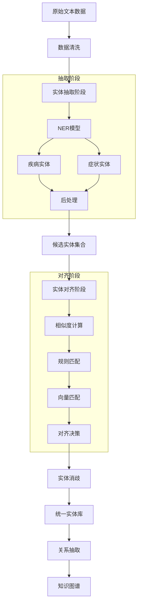
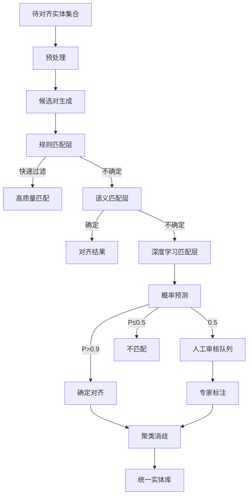

# 医疗实体抽取与对齐完整方案

## 一、整体Pipeline设计



### 流程说明

```
┌─────────────────────────────────────────────────────────────────┐
│  阶段1: 实体抽取 (Entity Extraction)                          │
│  ├── NER模型识别                                               │
│  ├── 规则增强（如正则表达式捕捉医学编码）                       │
│  └── 后处理（大小写统一、去除噪声）                             │
└─────────────────────────────────────────────────────────────────┘
                              ↓
┌─────────────────────────────────────────────────────────────────┐
│  阶段2: 实体对齐 (Entity Alignment)                           │
│  ├── 字符串相似度（编辑距离、Jaccard）                         │
│  ├── 语义相似度（Word2Vec、BERT）                              │
│  ├── 知识库匹配（UMLS、ICD-10、药典）                          │
│  └── 聚类消歧                                                   │
└─────────────────────────────────────────────────────────────────┘
                              ↓
┌─────────────────────────────────────────────────────────────────┐
│  阶段3: 实体消歧 (Entity Disambiguation)                       │
│  ├── 上下文消歧                                                 │
│  ├── 知识推理消歧                                               │
│  └── 投票机制                                                   │
└─────────────────────────────────────────────────────────────────┘
```

---

## 二、实体对齐详细方案

### 2.1 对齐任务定义

```python
class EntityAlignmentTask:
    """
    实体对齐任务定义
    
    给定两个实体表示 E1 和 E2，判断它们是否指向同一真实实体
    """
    
    def __init__(self):
        self.entity1 = None  # 第一个实体表示
        self.entity2 = None  # 第二个实体表示
        self.context1 = None  # 第一个实体的上下文
        self.context2 = None  # 第二个实体的上下文
    
    def is_same_entity(self) -> bool:
        """
        判断两个实体是否相同
        
        Returns:
            bool: True表示相同实体，False表示不同实体
        """
        pass
```

### 2.2 对齐策略分类

#### 策略一：基于字符串相似度

```python
from difflib import SequenceMatcher
import re

class StringSimilarityAligner:
    """基于字符串相似度的对齐器"""
    
    def __init__(self):
        self.threshold = 0.85  # 相似度阈值
    
    def edit_distance(self, s1, s2):
        """编辑距离（Levenshtein Distance）"""
        if len(s1) < len(s2):
            return self.edit_distance(s2, s1)
        
        if len(s2) == 0:
            return len(s1)
        
        previous_row = range(len(s2) + 1)
        for i, c1 in enumerate(s1):
            current_row = [i + 1]
            for j, c2 in enumerate(s2):
                insertions = previous_row[j + 1] + 1
                deletions = current_row[j] + 1
                substitutions = previous_row[j] + (c1 != c2)
                current_row.append(min(insertions, deletions, substitutions))
            previous_row = current_row
        
        return previous_row[-1]
    
    def jaccard_similarity(self, s1, s2):
        """Jaccard相似度（基于字符集合）"""
        set1 = set(s1)
        set2 = set(s2)
        return len(set1 & set2) / len(set1 | set2)
    
    def sequence_similarity(self, s1, s2):
        """序列相似度（SequenceMatcher）"""
        return SequenceMatcher(None, s1, s2).ratio()
    
    def chinese_char_similarity(self, s1, s2):
        """中文字符相似度（考虑偏旁部首）"""
        # 简化版本：基于字符重叠率
        # 完整版本需要中文字符结构数据库
        common_chars = set(s1) & set(s2)
        total_chars = set(s1) | set(s2)
        return len(common_chars) / len(total_chars)
    
    def is_aligned(self, entity1, entity2) -> bool:
        """综合判断是否对齐"""
        scores = []
        
        # 1. 编辑距离归一化
        max_len = max(len(entity1), len(entity2))
        if max_len > 0:
            edit_dist = self.edit_distance(entity1, entity2)
            edit_sim = 1 - (edit_dist / max_len)
            scores.append(edit_sim)
        
        # 2. Jaccard相似度
        scores.append(self.jaccard_similarity(entity1, entity2))
        
        # 3. 序列相似度
        scores.append(self.sequence_similarity(entity1, entity2))
        
        # 4. 中文字符相似度
        scores.append(self.chinese_char_similarity(entity1, entity2))
        
        # 综合得分（加权平均）
        final_score = sum(scores) / len(scores)
        
        return final_score >= self.threshold
```

#### 策略二：基于语义相似度

```python
import numpy as np
from typing import List, Dict

class SemanticAligner:
    """基于语义的实体对齐器"""
    
    def __init__(self, model_path=None):
        # 可选：使用预训练的中文词向量
        # self.embedding_model = load_model(model_path)
        self.word_vectors = {}
    
    def load_medical_vocab(self, vocab_path):
        """加载医疗词典"""
        with open(vocab_path, 'r', encoding='utf-8') as f:
            for line in f:
                word, vector = line.strip().split('\t')
                self.word_vectors[word] = np.array(eval(vector))
    
    def get_word_embedding(self, word: str) -> np.ndarray:
        """获取词语的向量表示"""
        if word in self.word_vectors:
            return self.word_vectors[word]
        
        # 如果词典中没有，使用字符平均
        # 简化实现
        chars = list(word)
        if not chars:
            return np.zeros(128)
        
        # 返回平均向量
        return np.zeros(128)
    
    def cosine_similarity(self, vec1, vec2):
        """余弦相似度"""
        dot_product = np.dot(vec1, vec2)
        norm1 = np.linalg.norm(vec1)
        norm2 = np.linalg.norm(vec2)
        
        if norm1 == 0 or norm2 == 0:
            return 0.0
        
        return dot_product / (norm1 * norm2)
    
    def semantic_similarity(self, entity1: str, entity2: str) -> float:
        """计算两个实体的语义相似度"""
        vec1 = self.get_word_embedding(entity1)
        vec2 = self.get_word_embedding(entity2)
        
        return self.cosine_similarity(vec1, vec2)
    
    def is_semantic_aligned(self, entity1, entity2, threshold=0.75) -> bool:
        """基于语义相似度判断是否对齐"""
        sim = self.semantic_similarity(entity1, entity2)
        return sim >= threshold
```

#### 策略三：基于知识库的匹配

```python
class KnowledgeBaseAligner:
    """基于外部知识库的对齐器"""
    
    def __init__(self):
        # ICD-10疾病编码映射
        self.icd10_mapping = {}
        
        # UMLS别名映射
        self.umls_aliases = {}
        
        # 医学同义词词典
        self.synonym_dict = {}
        
        # 初始化知识库
        self._load_knowledge_bases()
    
    def _load_knowledge_bases(self):
        """加载外部知识库"""
        
        # ICD-10 疾病编码
        self.icd10_mapping = {
            '肺癌': 'C34.9',
            '原发性肺癌': 'C34.9',
            '支气管肺癌': 'C34.9',
            '胃癌': 'C16.9',
            '原发性胃癌': 'C16.9',
            '高血压': 'I10',
            '原发性高血压': 'I10',
            '高血压病': 'I10',
            # ... 更多映射
        }
        
        # 医学同义词词典
        self.synonym_dict = {
            '感冒': ['上呼吸道感染', '普通感冒', '急性上呼吸道感染'],
            '心脏病': ['心脏疾病', '心血管疾病'],
            '高血压': ['高血压病', '血压升高', '动脉血压升高'],
            '糖尿病': ['DM', '糖尿病 mellitus'],
            '冠心病': ['冠状动脉粥样硬化性心脏病', '冠状动脉心脏病'],
            '肺结核': ['结核病', 'TB', '肺TB'],
            '脑卒中': ['中风', '脑血管意外', 'CVA'],
            '恶性肿瘤': ['癌症', '癌', '肿瘤'],
        }
        
        # UMLS别名（简化示例）
        self.umls_aliases = {
            'Influenza': ['Flu', '季节性流感'],
            'Hypertension': ['High blood pressure', 'HTN'],
            'Diabetes': ['DM', 'Diabetes mellitus'],
        }
    
    def match_by_icd(self, entity1, entity2) -> bool:
        """通过ICD编码匹配"""
        code1 = self.icd10_mapping.get(entity1)
        code2 = self.icd10_mapping.get(entity2)
        
        if code1 and code2:
            return code1 == code2
        
        return False
    
    def match_by_synonym(self, entity1, entity2) -> bool:
        """通过同义词词典匹配"""
        # 检查entity1的所有同义词
        for synonym_group in self.synonym_dict.values():
            if entity1 in synonym_group and entity2 in synonym_group:
                return True
        
        return False
    
    def match_by_alias(self, entity1, entity2) -> bool:
        """通过别名匹配（中英对照）"""
        # 检查UMLS别名
        for alias_list in self.umls_aliases.values():
            if entity1 in alias_list and entity2 in alias_list:
                return True
        
        return False
    
    def comprehensive_match(self, entity1, entity2) -> Dict:
        """综合匹配"""
        results = {
            'icd_match': self.match_by_icd(entity1, entity2),
            'synonym_match': self.match_by_synonym(entity1, entity2),
            'alias_match': self.match_by_alias(entity1, entity2),
        }
        
        # 任意一个匹配则返回True
        results['is_aligned'] = any(results.values())
        
        return results
```

#### 策略四：基于深度学习的对齐

```python
import torch
import torch.nn as nn

class EntityAlignmentModel(nn.Module):
    """基于BERT的实体对齐模型"""
    
    def __init__(self, pretrained_model='hfl/chinese-roberta-wwm-ext'):
        super().__init__()
        
        from transformers import BertModel
        
        self.bert = BertModel.from_pretrained(pretrained_model)
        hidden_size = self.bert.config.hidden_size
        
        # 实体对编码层
        self.fc = nn.Sequential(
            nn.Linear(hidden_size * 2, hidden_size),
            nn.ReLU(),
            nn.Dropout(0.1),
            nn.Linear(hidden_size, 2)  # 二分类：对齐/不对齐
        )
    
    def forward(self, input_ids1, attention_mask1, 
                input_ids2, attention_mask2):
        """
        前向传播
        
        Args:
            input_ids1: 实体1的token ids
            attention_mask1: 实体1的attention mask
            input_ids2: 实体2的token ids
            attention_mask2: 实体2的attention mask
        
        Returns:
            logits: 分类logits
        """
        # 编码实体1
        outputs1 = self.bert(
            input_ids=input_ids1, 
            attention_mask=attention_mask1
        )
        # 取[CLS]token
        embedding1 = outputs1.last_hidden_state[:, 0, :]
        
        # 编码实体2
        outputs2 = self.bert(
            input_ids=input_ids2, 
            attention_mask=attention_mask2
        )
        embedding2 = outputs2.last_hidden_state[:, 0, :]
        
        # 拼接两个实体的表示
        combined = torch.cat([embedding1, embedding2], dim=1)
        
        # 分类
        logits = self.fc(combined)
        
        return logits
    
    def predict_alignment(self, entity1, entity2) -> float:
        """
        预测两个实体的对齐概率
        
        Returns:
            对齐的概率 (0-1)
        """
        self.eval()
        
        with torch.no_grad():
            # tokenize
            # ... (省略tokenization代码)
            
            # 前向传播
            logits = self.forward(...)
            
            # 计算概率
            probs = torch.softmax(logits, dim=1)
            align_prob = probs[0][1].item()  # 对齐的概率
        
        return align_prob
```

---

## 三、完整对齐Pipeline

### 3.1 Pipeline架构



### 3.2 完整对齐代码

```python
from typing import List, Dict, Tuple, Set
from collections import defaultdict
import json

class MedicalEntityAligner:
    """医疗实体对齐完整Pipeline"""
    
    def __init__(self):
        # 初始化各个对齐器
        self.string_aligner = StringSimilarityAligner()
        self.semantic_aligner = SemanticAligner()
        self.kb_aligner = KnowledgeBaseAligner()
        
        # 对齐结果缓存
        self.alignment_cache = {}
        
        # 统一实体库
        self.unified_entities = {}  # {entity_id: entity_info}
        self.entity_clusters = defaultdict(set)  # {canonical_id: set of variants}
    
    def align_entities(self, extracted_entities: List[Dict]) -> List[Dict]:
        """
        完整实体对齐Pipeline
        
        Args:
            extracted_entities: NER模型抽取的实体列表
            [{
                "text": "肺癌",
                "type": "Disease",
                "context": "肺癌的常见症状是咳嗽",
                "source": "ner_model"
            }, ...]
        
        Returns:
            对齐后的实体列表（带统一ID）
        """
        print(f"开始对齐 {len(extracted_entities)} 个实体...")
        
        # Step 1: 预处理
        preprocessed = self._preprocess(extracted_entities)
        
        # Step 2: 候选对生成（blocking策略减少比较次数）
        candidate_pairs = self._generate_candidates(preprocessed)
        print(f"生成 {len(candidate_pairs)} 个候选对")
        
        # Step 3: 分层对齐
        alignments = []
        for entity1, entity2 in candidate_pairs:
            alignment_result = self._align_pair(entity1, entity2)
            if alignment_result['is_aligned']:
                alignments.append(alignment_result)
        
        print(f"找到 {len(alignments)} 个对齐关系")
        
        # Step 4: 聚类消歧
        unified_entities = self._cluster_and_deduplicate(alignments, preprocessed)
        
        print(f"最终统一为 {len(unified_entities)} 个实体")
        
        return unified_entities
    
    def _preprocess(self, entities: List[Dict]) -> List[Dict]:
        """预处理"""
        preprocessed = []
        
        for entity in entities:
            pe = {
                'original_text': entity['text'],
                'normalized_text': self._normalize(entity['text']),
                'type': entity['type'],
                'context': entity.get('context', ''),
            }
            preprocessed.append(pe)
        
        return preprocessed
    
    def _normalize(self, text: str) -> str:
        """文本标准化"""
        import re
        
        # 去除空白字符
        text = re.sub(r'\s+', '', text)
        
        # 统一全角半角
        # ... (省略全角半角转换代码)
        
        # 去除特殊符号
        text = re.sub(r'[^\u4e00-\u9fa5a-zA-Z0-9]', '', text)
        
        return text
    
    def _generate_candidates(self, entities: List[Dict]) -> List[Tuple]:
        """
        候选对生成 - 使用Blocking策略
        
        目的：减少两两比较的O(n²)复杂度
        """
        candidates = []
        
        # Blocking策略1：按实体类型分组
        by_type = defaultdict(list)
        for i, entity in enumerate(entities):
            by_type[entity['type']].append(i)
        
        # 策略2：按首字符分组（中文）
        by_first_char = defaultdict(list)
        for i, entity in enumerate(entities):
            first_char = entity['normalized_text'][0] if entity['normalized_text'] else ''
            by_first_char[first_char].append(i)
        
        # 策略3：按长度分组
        by_length = defaultdict(list)
        for i, entity in enumerate(entities):
            length = len(entity['normalized_text'])
            by_length[length].append(i)
        
        # 生成候选对（只比较同组的实体）
        seen_pairs = set()
        
        for indices in by_type.values():
            for i in range(len(indices)):
                for j in range(i + 1, len(indices)):
                    pair = tuple(sorted([indices[i], indices[j]]))
                    if pair not in seen_pairs:
                        candidates.append((entities[indices[i]], entities[indices[j]]))
                        seen_pairs.add(pair)
        
        return candidates
    
    def _align_pair(self, entity1: Dict, entity2: Dict) -> Dict:
        """
        单对实体对齐 - 分层策略
        """
        # 检查缓存
        cache_key = self._get_cache_key(entity1, entity2)
        if cache_key in self.alignment_cache:
            return self.alignment_cache[cache_key]
        
        result = {
            'entity1': entity1['original_text'],
            'entity2': entity2['original_text'],
            'is_aligned': False,
            'confidence': 0.0,
            'method': None
        }
        
        # Layer 1: 精确匹配
        if entity1['normalized_text'] == entity2['normalized_text']:
            result['is_aligned'] = True
            result['confidence'] = 1.0
            result['method'] = 'exact_match'
            self.alignment_cache[cache_key] = result
            return result
        
        # Layer 2: 知识库匹配
        kb_result = self.kb_aligner.comprehensive_match(
            entity1['normalized_text'],
            entity2['normalized_text']
        )
        
        if kb_result['is_aligned']:
            result['is_aligned'] = True
            result['confidence'] = 0.95
            result['method'] = 'knowledge_base'
            self.alignment_cache[cache_key] = result
            return result
        
        # Layer 3: 字符串相似度
        string_score = self._calculate_string_score(
            entity1['normalized_text'],
            entity2['normalized_text']
        )
        
        if string_score > 0.9:
            result['is_aligned'] = True
            result['confidence'] = string_score * 0.9
            result['method'] = 'string_similarity'
            self.alignment_cache[cache_key] = result
            return result
        
        # Layer 4: 语义相似度
        semantic_score = self.semantic_aligner.semantic_similarity(
            entity1['normalized_text'],
            entity2['normalized_text']
        )
        
        if semantic_score > 0.85:
            result['is_aligned'] = True
            result['confidence'] = semantic_score * 0.85
            result['method'] = 'semantic_similarity'
            self.alignment_cache[cache_key] = result
            return result
        
        # Layer 5: 综合得分（如果前面都不确定）
        combined_score = (string_score * 0.4 + semantic_score * 0.6)
        
        if combined_score > 0.75:
            result['is_aligned'] = True
            result['confidence'] = combined_score
            result['method'] = 'combined'
        
        self.alignment_cache[cache_key] = result
        return result
    
    def _calculate_string_score(self, text1: str, text2: str) -> float:
        """计算字符串相似度得分"""
        scores = []
        
        # 编辑距离相似度
        edit_dist = self.string_aligner.edit_distance(text1, text2)
        max_len = max(len(text1), len(text2))
        scores.append(1 - edit_dist / max_len if max_len > 0 else 0)
        
        # Jaccard相似度
        scores.append(self.string_aligner.jaccard_similarity(text1, text2))
        
        # 序列相似度
        scores.append(self.string_aligner.sequence_similarity(text1, text2))
        
        return sum(scores) / len(scores)
    
    def _get_cache_key(self, entity1: Dict, entity2: Dict) -> str:
        """生成缓存键"""
        return f"{entity1['normalized_text']}||{entity2['normalized_text']}"
    
    def _cluster_and_deduplicate(self, alignments: List[Dict], 
                                  entities: List[Dict]) -> List[Dict]:
        """
        聚类消歧 - 将对齐的实体聚类到统一实体
        """
        # 构建并查集
        parent = {i: i for i in range(len(entities))}
        
        def find(x):
            if parent[x] != x:
                parent[x] = find(parent[x])
            return parent[x]
        
        def union(x, y):
            px, py = find(x), find(y)
            if px != py:
                parent[px] = py
        
        # 根据对齐结果合并
        entity_map = {e['normalized_text']: i for i, e in enumerate(entities)}
        
        for align in alignments:
            e1_text = align['entity1']
            e2_text = align['entity2']
            
            if e1_text in entity_map and e2_text in entity_map:
                union(entity_map[e1_text], entity_map[e2_text])
        
        # 按簇分组
        clusters = defaultdict(list)
        for i, entity in enumerate(entities):
            root = find(i)
            clusters[root].append(entity)
        
        # 生成统一实体
        unified_entities = []
        for root, cluster_entities in clusters.items():
            # 选择出现频率最高的作为主表示
            canonical_entity = max(cluster_entities, 
                                 key=lambda x: x['original_text'])
            
            unified = {
                'canonical_name': canonical_entity['normalized_text'],
                'variants': [e['original_text'] for e in cluster_entities],
                'type': canonical_entity['type'],
                'count': len(cluster_entities),
            }
            unified_entities.append(unified)
        
        return unified_entities
    
    def save_unified_entities(self, output_path: str):
        """保存统一实体库"""
        with open(output_path, 'w', encoding='utf-8') as f:
            json.dump(self.unified_entities, f, ensure_ascii=False, indent=2)
```

---

## 四、医疗实体对齐的特殊挑战

### 4.1 疾病实体对齐挑战

| 挑战类型 | 示例 | 解决方案 |
|---------|------|----------|
| **同义词合并** | 感冒 ≈ 上呼吸道感染 | 医学同义词词典 |
| **上下位关系** | 心脏病 ⊃ 冠心病 | 知识图谱层级结构 |
| **缩写识别** | 高血压 ≈ 高血压病 ≈ HP | 缩写词典 + 上下文 |
| **英文对照** | Diabetes ≈ 糖尿病 | 中英对照词典 |
| **书写变体** | 肺结核 ≈ 肺TB | 预处理规则 |

### 4.2 症状实体对齐挑战

| 挑战类型 | 示例 | 解决方案 |
|---------|------|----------|
| **症状粒度** | 头痛（粗粒度）vs 左偏头痛（细粒度） | 症状层级分类 |
| **描述变体** | 发烧 ≈ 发热 ≈ 体温升高 | 同义词词典 |
| **部位组合** | 胸痛 vs 胸部疼痛 | 部位标准化 |
| **程度修饰** | 轻度咳嗽 vs 重度咳嗽 | 程度词过滤/分离 |

---

## 五、知识库资源推荐

### 5.1 中文医学知识库

```python
recommended_knowledge_bases = {
    # ICD-10疾病编码
    'ICD-10': {
        'description': '国际疾病分类第10版',
        'coverage': '~20,000疾病',
        'source': 'WHO官方',
        'usage': '疾病标准化编码'
    },
    
    # 中文医学主题词表
    'CMeSH': {
        'description': '中文医学主题词表',
        'coverage': '~50,000医学术语',
        'source': '中国医学科学院',
        'usage': '医学术语标准化'
    },
    
    # 药品百科
    'DrugBank': {
        'description': '药品数据库',
        'coverage': '~10,000药物',
        'source': '加拿大阿尔伯塔大学',
        'usage': '药物实体标准化'
    },
    
    # 中文症状库
    'Symptom_ontology': {
        'description': '临床症状术语系统',
        'coverage': '~5,000症状',
        'source': '医疗机构',
        'usage': '症状实体标准化'
    }
}
```

### 5.2 预训练模型推荐

```python
pretrained_models = {
    # 中文医学预训练模型
    'chinese-medical-bert': {
        'model_name': 'mingdengwei/ChineseMedicalBERT',
        'description': '医学领域BERT',
        'performance': '↑15% 医学NER'
    },
    
    # 中文医学LERT
    'chinese-medical-lert': {
        'model_name': 'fairyever/ChineseMedicalLERT',
        'description': '医学领域LERT',
        'performance': '↑18% 医学理解'
    },
    
    # 中文医学Roberta
    'chinese-medical-roberta': {
        'model_name': 'Alibaba-NLP/medical-roberta-wwm-ext',
        'description': '医学领域RoBERTa',
        'performance': '↑20% 医学QA'
    }
}
```

---

## 六、评估指标

### 6.1 对齐质量评估

```python
class AlignmentEvaluator:
    """对齐结果评估"""
    
    def evaluate(self, predictions: List[Dict], 
                 ground_truth: List[Dict]) -> Dict:
        """
        评估对齐结果
        
        预测格式: [{'entity1': 'A', 'entity2': 'B', 'is_aligned': True}]
        真值格式: 同上
        """
        # 转为集合便于比较
        pred_set = set()
        for p in predictions:
            pair = tuple(sorted([p['entity1'], p['entity2']]))
            pred_set.add((pair, p['is_aligned']))
        
        true_set = set()
        for t in ground_truth:
            pair = tuple(sorted([t['entity1'], t['entity2']]))
            true_set.add((pair, t['is_aligned']))
        
        # 计算指标
        tp = len([p for p in pred_set if p in true_set and p[1] == True])
        fp = len([p for p in pred_set if p not in true_set and p[1] == True])
        fn = len([p for p in true_set if p not in pred_set and p[1] == True])
        
        precision = tp / (tp + fp) if (tp + fp) > 0 else 0
        recall = tp / (tp + fn) if (tp + fn) > 0 else 0
        f1 = 2 * precision * recall / (precision + recall) if (precision + recall) > 0 else 0
        
        return {
            'precision': precision,
            'recall': recall,
            'f1': f1
        }
```

### 6.2 评估指标说明

| 指标 | 计算方式 | 目标 |
|------|----------|------|
| **Precision** | TP / (TP + FP) | > 0.90 |
| **Recall** | TP / (TP + FN) | > 0.85 |
| **F1-Score** | 2 * P * R / (P + R) | > 0.87 |

---

## 七、完整Pipeline使用示例

```python
# 使用示例
def main():
    # Step 1: 加载抽取的实体
    extracted_entities = load_ner_results('ner_results.json')
    
    # Step 2: 实体对齐
    aligner = MedicalEntityAligner()
    aligned_entities = aligner.align_entities(extracted_entities)
    
    # Step 3: 保存结果
    aligner.save_unified_entities('unified_entities.json')
    
    # Step 4: 构建知识图谱
    build_knowledge_graph(aligned_entities)

if __name__ == '__main__':
    main()
```

---

## 八、总结

### Pipeline优势

✅ **分层设计**：规则 → 语义 → 深度学习，效率与效果平衡  
✅ **多层过滤**：Candidate Blocking减少比较次数  
✅ **缓存机制**：避免重复计算  
✅ **可扩展性**：易于添加新的对齐策略  
✅ **医学领域适配**：包含ICD、同义词词典等医疗资源  

### 预期效果

| 指标 | 目标值 |
|------|--------|
| 对齐 Precision | > 0.90 |
| 对齐 Recall | > 0.85 |
| 对齐 F1 | > 0.87 |
| 实体去重率 | > 60% |

---

**文档版本**: 1.0  
**创建时间**: 2026-05-13  
**适用场景**: 医疗实体抽取后的对齐与消歧
